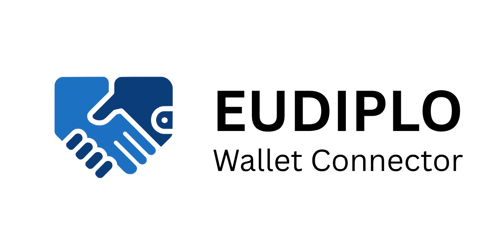
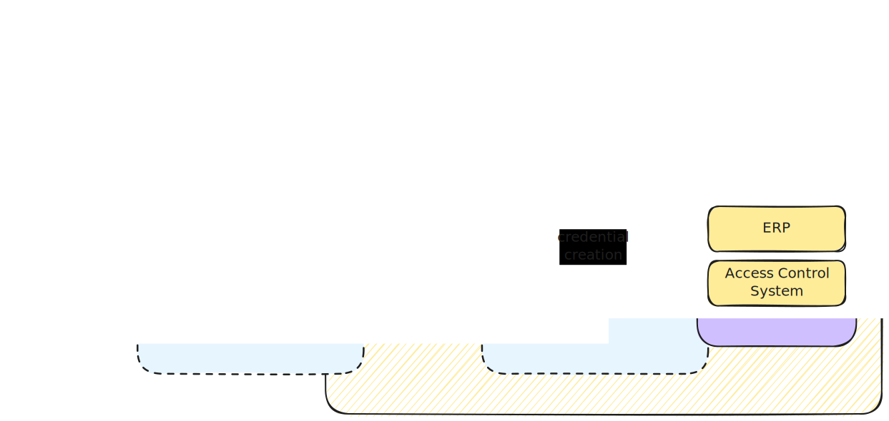

[](https://github.com/openwallet-foundation-labs/eudiplo/actions)

[](https://openwallet-foundation-labs.github.io/eudiplo/latest/)
[](https://openwallet-foundation-labs.github.io/eudiplo/main/compodoc/coverage.html)
[](https://codecov.io/github/openwallet-foundation-labs/eudiplo)
[](https://discord.gg/58ys8XfXDu)

**Your Diplomatic Layer for EUDI Wallet Integration**

EUDIPLO is an open-source middleware that bridges your backend and EUDI Wallets
using a unified API and standardized protocols.

---

## 🧭 Overview

Organizations joining the EUDI Wallet ecosystem face a tough choice: patch
together protocol libraries that may not exist for their stack, or rely on
proprietary solutions that risk vendor lock-in.

**EUDIPLO** solves this by providing a lightweight, source-available, protocol
abstraction layer. It communicates over HTTP and integrates easily with your
existing backend stack—so you can focus on your business logic, not
cryptographic plumbing.

It supports all core flows of electronic attribute attestations—**issuing**,
**requesting**, and even **requesting during issuance**—and is already
compatible with multiple
[wallets](./docs/getting-started/wallet-compatibility.md).

While still in early development, EUDIPLO is built for production: secure key
management, scalable database support, and clean API boundaries.

## 

## 🧩 Features

- ✅ Supports **OID4VCI**, **OID4VP**, **SD-JWT VC**, and **OAuth Token Status
  List**
- ✅ JSON-based credential configuration
- ✅ Client credentials authentication for easy service integration
- ✅ Runs via Docker with `.env` config
- ✅ HTTP-based integration with any backend
- ✅ Secure key management & pluggable storage
- ✅ Privacy-friendly: no external calls, no long-term storage

---

## 🚀 Quick Start

```bash
# Clone and configure
git clone https://github.com/openwallet-foundation-labs/eudiplo.git
cd eudiplo
cp .env.example .env

# Configure authentication
echo "JWT_SECRET=$(openssl rand -base64 32)" >> .env
echo "AUTH_CLIENT_SECRET=$(openssl rand -base64 24)" >> .env

# Start with Docker
docker run -p 3000:3000 \
  -e PUBLIC_URL=https://example.com \
  -e JWT_SECRET=your-32-character-secret \
  -e AUTH_CLIENT_SECRET=your-issuer-secret \
  -v $(pwd)/config:/app/config \
  ghcr.io/openwallet-foundation-labs/eudiplo:latest

# Get a token and start using the API
curl -X POST http://localhost:3000/oauth2/token \
  -H "Content-Type: application/json" \
  -d '{
    "client_id": "root",
    "client_secret": "root"
  }'
```

📚 API:
[https://openwallet-foundation-labs.github.io/eudiplo/latest/api/](https://openwallet-foundation-labs.github.io/eudiplo/latest/api/)  
📦
Full setup:
[Quickstart Guide](https://openwallet-foundation-labs.github.io/eudiplo/latest/getting-started/quick-start/)

---

## 📚 Documentation

**Choose your documentation version:**

- 🚀 **Latest Stable** (recommended):
  [https://openwallet-foundation-labs.github.io/eudiplo/latest/](https://openwallet-foundation-labs.github.io/eudiplo/latest/) -
  Documentation for the most recent major release
- 🔬 **Development**:
  [https://openwallet-foundation-labs.github.io/eudiplo/main/](https://openwallet-foundation-labs.github.io/eudiplo/main/) -
  Latest features from the main branch
- 📚 **Specific Major Versions**:
  [v1](https://openwallet-foundation-labs.github.io/eudiplo/1/),
  [v2](https://openwallet-foundation-labs.github.io/eudiplo/2/), etc.

**Key sections:**

- [Architecture](https://openwallet-foundation-labs.github.io/eudiplo/latest/architecture/overview/)
- [Supported Protocols](https://openwallet-foundation-labs.github.io/eudiplo/latest/architecture/supported-protocols/)
- [API Reference](https://openwallet-foundation-labs.github.io/eudiplo/latest/api/)
- [Code Documentation](https://openwallet-foundation-labs.github.io/eudiplo/latest/compodoc/)

---

## 🤝 Contributing

We welcome PRs from wallet developers, institutions, and contributors interested
in advancing the EUDI Wallet ecosystem.

See [CONTRIBUTING.md](CONTRIBUTING.md) for guidelines.

💬 **Have questions?** Join our
[Discord community](https://discord.gg/58ys8XfXDu) to ask questions, get help,
and connect with other developers.

---

## 📝 License

Licensed under the [Apache 2.0 License](LICENSE)
