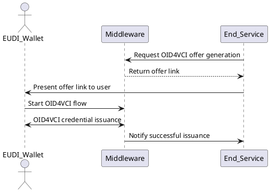
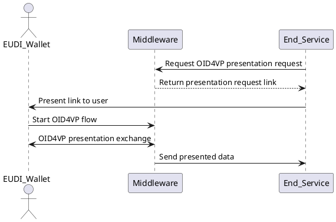
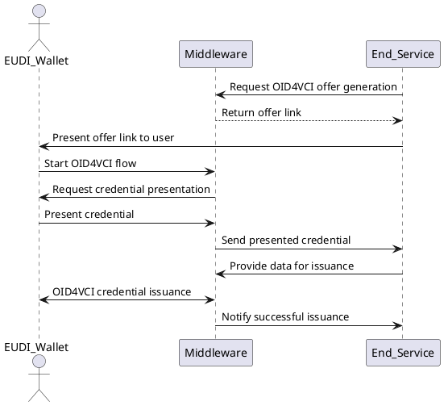

# EUDIPLO – Your diplomatic layer for EUDI Wallet integration

**EUDIPLO** is a lightweight, open-source middleware that acts as a protocol translator between your backend service and EUDI Wallets. It exposes a simple JSON-based interface while handling the complexity of EUDI protocols internally.

EUDIPLO is designed to run **on-premise**. It does **not act as an intermediary** or forward data to external services, ensuring that all wallet interactions stay within your infrastructure.

- [Configuration](docs/config.md)
- [Databases](docs/databases.md)
- [Key Management](docs/key-management.md)
- [Supported Protocols](docs/supported-protocols.md)

---

## Credential Issuance Flow

This flow describes how a backend service initiates the issuance of a verifiable credential via the OID4VCI protocol. The end-user receives an offer link, opens it in their wallet, and receives the credential directly from EUDIPLO.

---

## Credential Presentation Flow

This flow describes how a backend service requests a credential presentation (e.g., to authorize a user or verify an attribute). EUDIPLO creates the OID4VP request and handles the protocol flow with the wallet.

---

## Credential Presentation During Issuance Flow

This flow describes an advanced scenario where the end-user is required to **present a credential** during the issuance of another credential. This is useful when a prior attribute (e.g. student ID, PID) is needed to qualify for the new credential.

---
