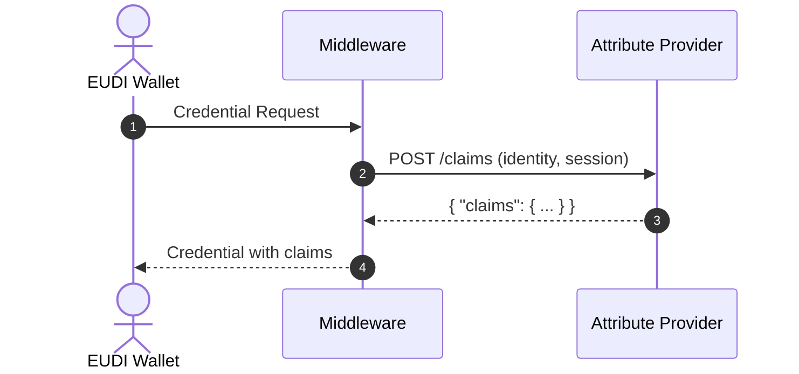
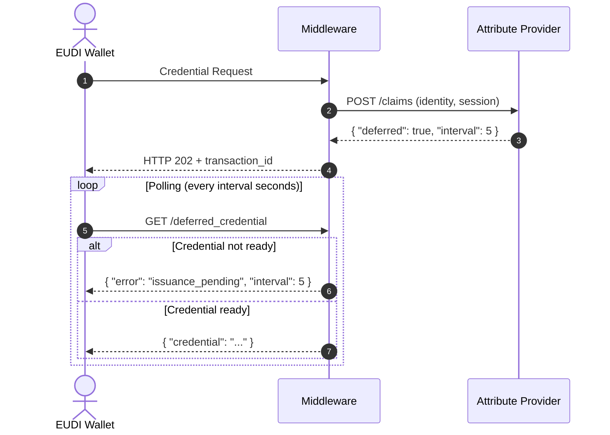

# Attribute Providers

**Attribute Providers** are tenant-level resources that define how EUDIPLO fetches claims from your backend services during credential issuance.

!!! info "Attribute Providers vs. Webhooks"

    **Attribute Providers** are designed to **fetch data IN** — retrieving claims from your backend to include in credentials.

    **Webhooks** are designed to **send data OUT** — notifying your backend when events occur (e.g., credential issued, presentation completed).

    For sending notifications, see [Webhooks](./webhooks.md).

---

## Overview

When issuing credentials, EUDIPLO needs to populate the credential with claims (attributes). These claims can come from several sources:

1. **Static claims** — Defined in the credential configuration or passed at offer time
2. **Attribute Providers** — Fetched dynamically from your backend via HTTP

Attribute Providers are the recommended approach for production deployments because they:

- **Centralize configuration** — Define once, reuse across multiple credential configurations
- **Improve security** — Sensitive data is fetched just-in-time, not stored in offers
- **Enable dynamic claims** — Claims can be computed or retrieved from external systems
- **Support deferred issuance** — Your backend can signal that processing is needed

---

## How It Works



1. The wallet requests a credential from EUDIPLO
2. EUDIPLO calls the configured Attribute Provider with identity context
3. Your backend returns the claims to include in the credential
4. EUDIPLO issues the credential with those claims

---

## Configuration

An Attribute Provider is a tenant-level resource with:

| Field    | Type   | Description                                 |
| -------- | ------ | ------------------------------------------- |
| `id`     | string | Unique identifier within the tenant         |
| `name`   | string | Human-readable name                         |
| `config` | object | Webhook configuration (URL, authentication) |

### Example

```json
{
    "id": "employee-claims-api",
    "name": "Employee Claims API",
    "config": {
        "url": "https://hr.example.com/api/claims",
        "auth": {
            "type": "apiKey",
            "config": {
                "headerName": "x-api-key",
                "value": "your-api-key"
            }
        }
    }
}
```

---

## Usage

Reference an Attribute Provider in your credential configuration:

```json
{
    "id": "EmployeeBadge",
    "attributeProviderId": "employee-claims-api",
    "config": {
        "format": "vc+sd-jwt",
        "vct": "EmployeeBadge"
    }
}
```

Or override at offer time:

```json
{
    "credentialClaims": {
        "EmployeeBadge": {
            "type": "attributeProvider",
            "attributeProviderId": "employee-claims-api"
        }
    }
}
```

---

## Deferred Issuance

**Deferred issuance** allows your Attribute Provider to signal that the credential cannot be issued immediately. This is useful when:

- Background verification is required (e.g., KYC, identity proofing)
- An approval workflow must be completed
- External data sources need time to respond
- The credential requires asynchronous processing

### How It Works

When your Attribute Provider returns a **deferred response**, EUDIPLO:

1. Stores the pending request with a `transaction_id`
2. Returns HTTP 202 (Accepted) to the wallet with the `transaction_id`
3. The wallet polls the **deferred credential endpoint** until the credential is ready



### Deferred Response Format

To trigger deferred issuance, your Attribute Provider should return:

```json
{
    "deferred": true,
    "interval": 5
}
```

| Field      | Type    | Description                                          |
| ---------- | ------- | ---------------------------------------------------- |
| `deferred` | boolean | Set to `true` to defer the credential issuance       |
| `interval` | number  | Recommended polling interval in seconds (default: 5) |

### Completing Deferred Issuance

Once your backend has completed processing, call EUDIPLO's API to provide the claims:

```bash
# Complete the deferred transaction with claims
POST /issuer/deferred/{transactionId}/complete
Content-Type: application/json
Authorization: Bearer <your-token>

{
    "claims": {
        "given_name": "John",
        "family_name": "Doe",
        "employee_id": "EMP-12345"
    }
}
```

Or, if the issuance failed:

```bash
# Mark the deferred transaction as failed
POST /issuer/deferred/{transactionId}/fail
Content-Type: application/json
Authorization: Bearer <your-token>

{
    "errorMessage": "KYC verification failed"
}
```

### Deferred Credential Errors

When the wallet polls the deferred credential endpoint, it may receive:

| Error Code               | HTTP Status | Description                                           |
| ------------------------ | ----------- | ----------------------------------------------------- |
| `issuance_pending`       | 400         | Credential is still being processed. Retry later.     |
| `invalid_transaction_id` | 400         | Transaction not found, expired, or already retrieved. |

The `issuance_pending` error includes an `interval` field indicating when to retry:

```json
{
    "error": "issuance_pending",
    "error_description": "The credential issuance is still pending",
    "interval": 5
}
```

### Transaction Lifecycle

Deferred transactions have the following states:

| Status      | Description                                      |
| ----------- | ------------------------------------------------ |
| `pending`   | Waiting for your backend to complete processing  |
| `ready`     | Credential is ready for wallet retrieval         |
| `retrieved` | Wallet has successfully retrieved the credential |
| `expired`   | Transaction expired (default: 24 hours)          |
| `failed`    | Issuance failed due to an error                  |

!!! info "Transaction Expiry"

    Deferred transactions expire after 24 hours by default. Expired transactions are automatically cleaned up hourly.

---

## Detailed Documentation

For complete documentation including:

- API endpoints for managing Attribute Providers
- Request/response formats
- Identity context and token claims
- Integration with Interactive Authorization (IAE)
- Error handling and best practices

See the [Attribute Provider Getting Started Guide](../getting-started/issuance/attribute-provider.md).
