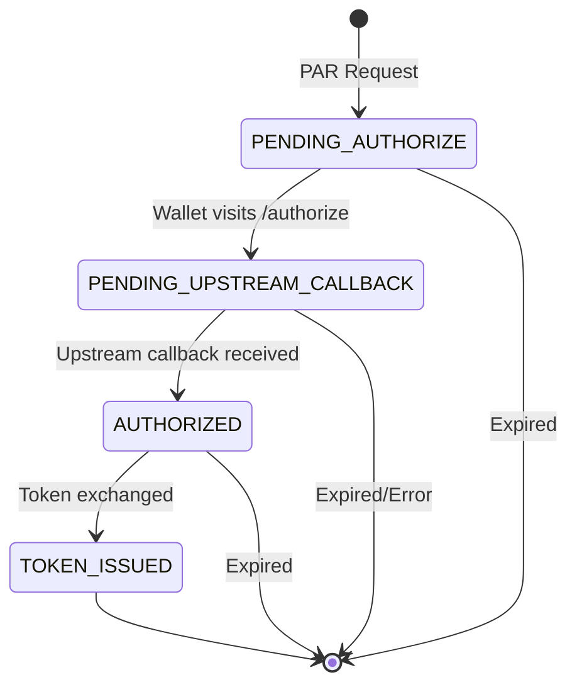

# Chained Authorization Server

The Chained Authorization Server (Chained AS) is an optional mode where EUDIPLO
acts as an OAuth 2.0 Authorization Server facade. Instead of implementing user
authentication directly, it delegates to an upstream OIDC provider while issuing
its own access tokens with custom claims for session correlation.

## Overview

In credential issuance flows using the authorization code grant, the wallet needs
an access token to request credentials. Typically, this token comes from either:

1. **EUDIPLO's built-in AS** - Simple setup, but requires EUDIPLO to handle user authentication
2. **External AS (e.g., Keycloak)** - Uses existing identity infrastructure, but requires the AS to include `issuer_state` claim

The **Chained AS** provides a third option: EUDIPLO acts as the AS but delegates
authentication to an upstream OIDC provider. This combines the benefits of both
approaches without requiring modifications to your existing OIDC provider.

## Architecture

```mermaid
flowchart TB
    subgraph Wallet
        W[EUDI Wallet]
    end

    subgraph EUDIPLO
        subgraph ChainedAS["Chained AS"]
            PAR[PAR Endpoint]
            AUTH[Authorize]
            CB[Callback]
            TOK[Token]
        end
        VCI[OID4VCI Endpoints]
        SM[Session Manager]
    end

    subgraph Upstream["Upstream OIDC Provider"]
        UA[/authorize]
        UT[/token]
    end

    W -->|1. PAR| PAR
    PAR -->|2. Create session| SM
    W -->|3. Authorize| AUTH
    AUTH -->|4. Redirect| UA
    UA -->|5. User authenticates| UA
    UA -->|6. Callback| CB
    CB -->|7. Exchange code| UT
    CB -->|8. Store identity| SM
    W -->|9. Token request| TOK
    TOK -->|10. Issue token| W
    W -->|11. Credential request| VCI
    VCI -->|12. Lookup session| SM
```

## Session Flow States

The Chained AS maintains session state through the OAuth flow:



## Token Structure

Access tokens issued by the Chained AS are JWTs signed by EUDIPLO containing:

| Claim          | Description                                                |
| -------------- | ---------------------------------------------------------- |
| `iss`          | Chained AS issuer URL (`{PUBLIC_URL}/{tenant}/chained-as`) |
| `sub`          | Client ID of the requesting wallet                         |
| `aud`          | EUDIPLO credential issuer URL                              |
| `issuer_state` | Session ID for credential offer correlation                |
| `client_id`    | Wallet's client identifier                                 |
| `upstream_sub` | Subject from upstream ID token                             |
| `upstream_iss` | Issuer from upstream ID token                              |
| `cnf.jkt`      | DPoP key thumbprint (if DPoP enabled)                      |

## Comparison with Other Modes

| Feature                  | Built-in AS     | External AS               | Chained AS        |
| ------------------------ | --------------- | ------------------------- | ----------------- |
| User authentication      | EUDIPLO handles | External provider         | External provider |
| Token issuer             | EUDIPLO         | External                  | EUDIPLO           |
| `issuer_state` in token  | ✅ Automatic    | ❌ Requires customization | ✅ Automatic      |
| Session correlation      | ✅ Native       | ⚠️ Via webhook            | ✅ Native         |
| Modify external provider | N/A             | Required                  | Not required      |
| DPoP support             | ✅              | Depends on provider       | ✅                |
| Wallet attestation       | ✅              | ❌ Not possible           | ✅                |

## Security Considerations

### Client Secret Management

The upstream client secret is stored in the issuance configuration. Consider:

- Using environment variables for secrets in production
- Rotating secrets periodically
- Using a secrets manager for enterprise deployments

### PKCE

The Chained AS enforces PKCE (Proof Key for Code Exchange) for all authorization
flows to prevent authorization code interception attacks.

### DPoP

When `requireDPoP` is enabled, wallets must provide a DPoP proof with their
token request. The proof's public key thumbprint is bound to the access token
via the `cnf.jkt` claim.

### State Parameter

The Chained AS generates a cryptographically random state parameter for the
upstream authorization request, preventing CSRF attacks.

## Configuration

See [Issuance Configuration > Chained Authorization Server](../getting-started/issuance/issuance-configuration.md#chained-authorization-server)
for configuration details and examples.

## Endpoints Reference

All endpoints are tenant-scoped:

| Endpoint                                                      | Method | Auth | Description                                       |
| ------------------------------------------------------------- | ------ | ---- | ------------------------------------------------- |
| `/{tenant}/chained-as/par`                                    | POST   | None | Pushed Authorization Request - initiates the flow |
| `/{tenant}/chained-as/authorize`                              | GET    | None | Authorization endpoint - redirects to upstream    |
| `/{tenant}/chained-as/callback`                               | GET    | None | Handles upstream callback                         |
| `/{tenant}/chained-as/token`                                  | POST   | None | Exchanges code for access token                   |
| `/{tenant}/chained-as/.well-known/oauth-authorization-server` | GET    | None | AS metadata discovery                             |
| `/{tenant}/chained-as/.well-known/jwks.json`                  | GET    | None | Public keys for token verification                |

## Upstream Provider Requirements

The upstream OIDC provider must:

1. **Support OIDC Discovery** - Publish `.well-known/openid-configuration`
2. **Support Authorization Code Flow** - With `response_type=code`
3. **Allow Confidential Clients** - Client credentials authentication at token endpoint
4. **Return ID Tokens** - Include `sub` and `iss` claims

Tested providers:

- Keycloak
- Auth0
- Azure AD / Entra ID
- Google Identity Platform
