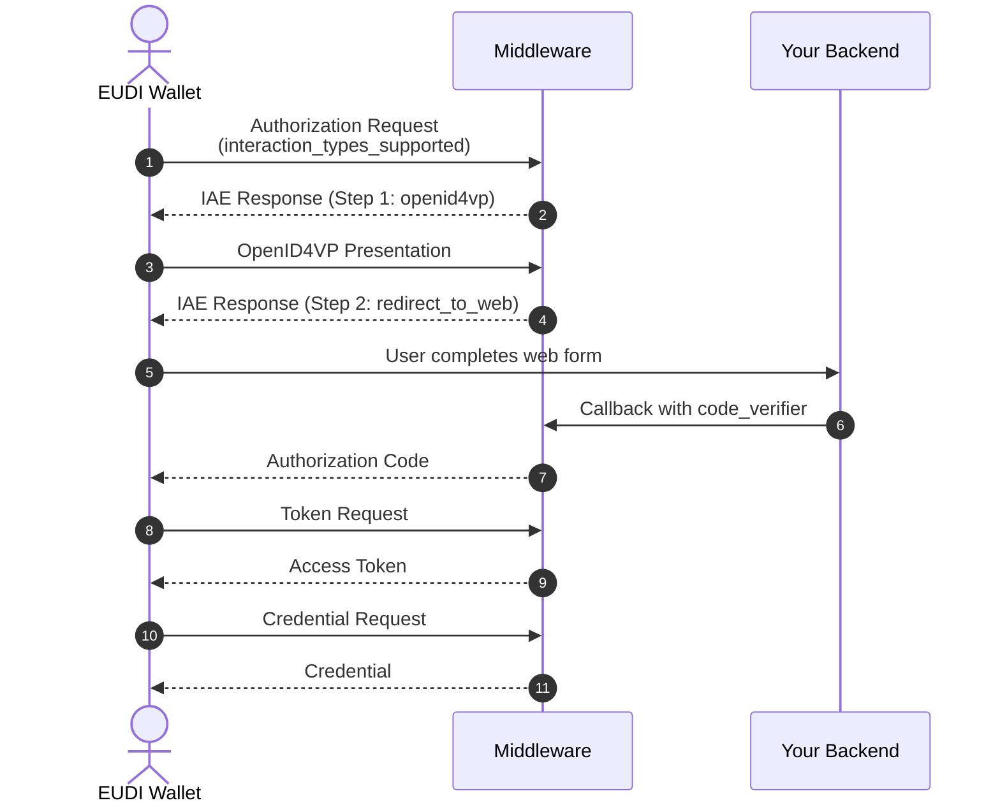

# Interactive Authorization Endpoint (IAE)

The **Interactive Authorization Endpoint (IAE)** enables user interactions during the credential issuance flow. It allows wallets to request user authorization through a sequence of configurable actions before credential issuance completes.

This is particularly useful for:

- **Identity verification** – Request a verifiable presentation from the wallet (e.g., PID, mDL)
- **Web-based flows** – Redirect users to complete forms, payments, or external verification
- **Multi-step authorization** – Combine multiple actions in sequence (e.g., present ID, then complete KYC form)

---

## How It Works

The IAE is part of the OID4VCI authorization code flow. When a wallet initiates issuance with `interaction_types_supported`, EUDIPLO responds with the first required action. The wallet must complete each action in sequence before receiving an authorization code.



---

## Supported Action Types

IAE supports the following action types, which can be combined in any order:

| Action Type              | Description                                                                 |
| ------------------------ | --------------------------------------------------------------------------- |
| `openid4vp_presentation` | Request a verifiable presentation from the wallet using OpenID4VP           |
| `redirect_to_web`        | Redirect the user to a web page for additional interaction (forms, payment) |

---

## Configuring IAE Actions

IAE actions are configured per credential configuration. You can define a sequence of actions that must be completed before credential issuance.

### Example: Single Presentation

Request a PID presentation before issuing a credential:

```json
{
    "credentialConfigId": "citizen-credential",
    "iaeActions": [
        {
            "type": "openid4vp_presentation",
            "label": "Identity Verification",
            "presentationConfigId": "pid-presentation-config"
        }
    ]
}
```

### Example: Multi-Step Flow

First verify identity with a presentation, then redirect to a web form:

```json
{
    "credentialConfigId": "organization-credential",
    "iaeActions": [
        {
            "type": "openid4vp_presentation",
            "label": "Identity Verification",
            "presentationConfigId": "pid-presentation-config"
        },
        {
            "type": "redirect_to_web",
            "label": "Complete Registration",
            "url": "https://example.com/register?session={auth_session}",
            "description": "Please complete the organization registration form"
        }
    ]
}
```

---

## Action Types Reference

### OpenID4VP Presentation

Requests a verifiable presentation from the wallet.

| Field                  | Type   | Required | Description                                 |
| ---------------------- | ------ | -------- | ------------------------------------------- |
| `type`                 | string | Yes      | Must be `"openid4vp_presentation"`          |
| `label`                | string | No       | Display label for this step                 |
| `presentationConfigId` | string | Yes      | ID of the presentation configuration to use |

The presentation configuration defines which credentials and claims to request. See [Presentation Configuration](./presentations.md) for details.

### Redirect to Web

Redirects the user to a web page for additional interaction.

| Field         | Type   | Required | Description                                                         |
| ------------- | ------ | -------- | ------------------------------------------------------------------- |
| `type`        | string | Yes      | Must be `"redirect_to_web"`                                         |
| `label`       | string | No       | Display label for this step                                         |
| `url`         | string | Yes      | URL to redirect the user to (supports `{auth_session}` placeholder) |
| `callbackUrl` | string | No       | URL for the external service to redirect back to                    |
| `description` | string | No       | Instructions for the user (displayed in wallet)                     |

The `{auth_session}` placeholder in the URL is replaced with the session identifier, allowing your backend to correlate the web interaction with the issuance flow.

---

## Completing Web-Based Actions

When using `redirect_to_web`, your backend must signal completion by calling back to EUDIPLO with a `code_verifier`:

```bash
POST /{tenantId}/oid4vci/authorize/interactive
Content-Type: application/json

{
    "auth_session": "<session-id>",
    "code_verifier": "<unique-verifier>"
}
```

EUDIPLO will verify the `code_verifier` and either:

- Return the next action (if more steps remain), or
- Issue the authorization code (if all steps are complete)

---

## Session State

During the IAE flow, EUDIPLO tracks:

| Field                | Description                             |
| -------------------- | --------------------------------------- |
| `currentStepIndex`   | Index of the current action (0-based)   |
| `completedStepsData` | Data collected from each completed step |
| `iaeActions`         | The configured action sequence          |

This state is managed automatically. Your backend only needs to respond to the configured actions.

---

## Claims Webhook Integration

When an `openid4vp_presentation` action is completed, EUDIPLO can call a **claims webhook** to transform the verified presentation data into credential claims.

See [Webhooks](./webhooks.md#claims-webhook) for configuration details.

---

## Fallback Behavior

If no `iaeActions` are configured for a credential, EUDIPLO falls back to the wallet's `interaction_types_supported` preference:

1. If the wallet supports `openid4vp` and a presentation configuration exists → use OpenID4VP
2. If the wallet supports `redirect_to_web` → use web redirect
3. Otherwise → return an error

This ensures backward compatibility with wallets that don't support multi-step flows.

---

## Error Handling

IAE errors are returned as JSON:

```json
{
    "error": "invalid_request",
    "error_description": "Missing required field: code_verifier"
}
```

Common errors:

| Error Code              | Description                                  |
| ----------------------- | -------------------------------------------- |
| `invalid_request`       | Missing required parameters                  |
| `invalid_auth_session`  | Session not found or expired                 |
| `invalid_code_verifier` | Code verifier mismatch for web authorization |
| `presentation_failed`   | OpenID4VP presentation verification failed   |
