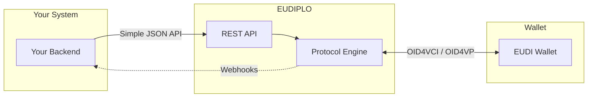
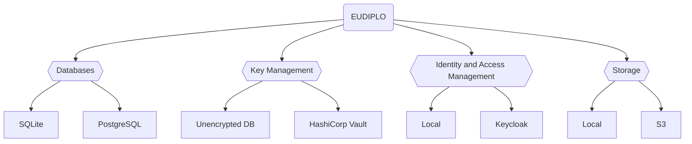

# Architecture Overview

**EUDIPLO** is a lightweight middleware designed to bridge the gap between
existing systems and the emerging ecosystem of **EUDI Wallets**. Instead of
implementing complex protocols such as OpenID4VP, SD-JWT, or DIDComm themselves,
developers can run EUDIPLO as a standalone Docker container and interact with it
via simple APIs or configuration files.

It acts as an **adapter** between trusted infrastructure and local applications
or web services. EUDIPLO handles the complexities of the EUDI Wallet ecosystem,
allowing you to focus on your core business logic without worrying about the
underlying protocols.

---

## What EUDIPLO Is (and Isn't)

Understanding EUDIPLO's role helps you integrate it correctly:

### EUDIPLO is a **Protocol Adapter / Middleware**

| ✅ What EUDIPLO **IS**                                                        | ❌ What EUDIPLO **IS NOT**                                                        |
| ----------------------------------------------------------------------------- | --------------------------------------------------------------------------------- |
| A **protocol translator** – converts simple API calls to OID4VCI/OID4VP       | A **Backend-for-Frontend (BFF)** – it doesn't serve your UI or aggregate APIs     |
| A **credential factory** – signs and packages credentials in standard formats | A **proxy** – it doesn't forward requests transparently                           |
| A **session manager** – tracks issuance and verification flows                | A **wallet** – it issues TO wallets, it doesn't store credentials for users       |
| A **key manager** – securely stores and uses cryptographic keys               | An **identity provider** – it doesn't authenticate end users (use Keycloak, etc.) |

### Typical Integration Pattern

For a visual overview, see the [system diagram](../index.md#how-it-works) on the home page.

**Issuance Flow:**
Your backend calls EUDIPLO's simple REST API → EUDIPLO handles OID4VCI protocol → Wallet receives credential

**Verification Flow:**
Your backend requests verification → EUDIPLO creates OID4VP request → Wallet presents credential → EUDIPLO validates and notifies your backend via webhook

### When to Use EUDIPLO

- You want to issue or verify EUDI Wallet credentials without implementing OID4VCI/OID4VP yourself
- You need a protocol-agnostic layer between your existing systems and wallets
- You want to experiment with EUDI protocols in a sandbox environment

### When NOT to Use EUDIPLO

- You need a user-facing authentication service (use Keycloak + EUDIPLO instead)
- You want to build a wallet application (EUDIPLO is for issuers/verifiers)
- You need a simple API gateway or reverse proxy

---

## Structure

EUDIPLO is built on a modular architecture, where each module is a plug-and-play component responsible for a specific system function. This design promotes separation of concerns, maintainability, and easy integration of new features.

The core modules include:

- **Database:** Stores application and credential data.
- **Key Management:** Handles secure storage and management of cryptographic keys.
- **Identity and Access Management:** Manages access to the tenant's resources.
- **Storage:** Provides persistent storage for files and artifacts.

Modules are activated via environment variable configuration. You select which backend to use globally for each module by setting the appropriate environment variables before starting EUDIPLO.

> **Note:** EUDIPLO is not designed to set individual database or storage options per tenant. All tenants share the same backend configuration for each module. If you need to switch backends, you are responsible for writing your own migration strategy to move existing data.

This modular approach allows you to run EUDIPLO with simple local backends during development, and swap to scalable, secure services in production—without changing your application code.

For example, switching from local key management to HashiCorp Vault only requires updating your configuration.

---

## Deployment

EUDIPLO is shipped as a Docker image. It can be run with minimal setup via a
`.env` file. You can mount:

- a `config/` directory for SQLite data or credential configuration
- optional integration with Vault for key storage

EUDIPLO can be deployed as:

- a **standalone local service** (e.g., during development)
- a **backend service** in production (e.g., behind a gateway)

You can find examples of deployments in the
[deployment](https://github.com/openwallet-foundation-labs/eudiplo/tree/main/deployment)
directory.

For configuration management, see
[Configuration Import](./configuration-import.md) to learn how to bootstrap your
deployment with pre-configured credentials and workflows.

---

## Integration Patterns

You can use EUDIPLO as:

- An **internal credential issuance service** for your citizen portal, education
  platform, or company registry
- A **verifier bridge** to validate wallets without deeply integrating OpenID4VP
  etc.
- A **testing sandbox** for experimenting with EUDI protocols

---

## Extensibility

EUDIPLO is modular and extensible:

- Add new key management backends (e.g., AWS KMS)
- Customize issuance templates
- Extend the API layer with business-specific endpoints
