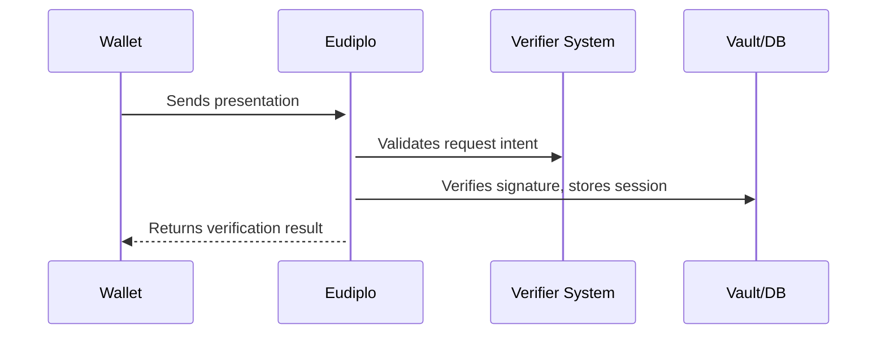

# Architecture Overview

**Eudiplo** is a lightweight middleware designed to bridge the gap between existing systems and the emerging ecosystem of **EUDI Wallets**. Instead of implementing complex protocols such as OpenID4VP, SD-JWT, or DIDComm themselves, developers can run Eudiplo as a standalone Docker container and interact with it via simple APIs or configuration files.

It acts as an **adapter** between trusted infrastructure and local applications or web services.

---

## 🧩 Purpose

The EUDI Wallet ecosystem introduces new technical standards and trust models that are non-trivial to implement correctly. Eudiplo handles these standards for you, allowing existing systems to:

- **Issue** verifiable credentials
- **Verify** presentations
- **Manage** cryptographic keys securely
- **Persist** session data
- **Run in a self-contained Docker deployment**

---

## 🔧 Main Components

| Module         | Responsibility                                                  |
|----------------|------------------------------------------------------------------|
| `KeyModule`    | Manages signing keys (filesystem or Vault)                      |
| `DatabaseModule` | Stores session information using SQLite or PostgreSQL          |
| `CryptoModule` | Provides local encryption utilities for sensitive data          |
| `IssuerModule` | Loads and applies credential issuance configurations            |
| `VerifierModule` | Handles verification of incoming presentations                 |
| `API Module`   | Exposes HTTP endpoints for credential flows and health checks   |

---

## 🔁 Typical Flow

Here’s a simplified data flow for a verification interaction:

Similarly, for issuance, Eudiplo prepares credential data and signs it with a trusted key.

---

## ⚙️ Deployment

Eudiplo is shipped as a Docker image. It can be run with minimal setup via a `.env` file. You can mount:

- a `config/` directory for SQLite data or credential configuration
- optional integration with Vault for key storage

Eudiplo can be deployed as:

- a **standalone local service** (e.g., during development)
- a **backend service** in production (e.g., behind a gateway)

---

## 📦 Integration Patterns

You can use Eudiplo as:

- An **internal credential issuance service** for your citizen portal, education platform, or company registry
- A **verifier bridge** to validate wallets without deeply integrating OpenID4VP etc.
- A **testing sandbox** for experimenting with EUDI protocols

---

## 🔄 Extensibility

Eudiplo is modular and extensible:

- Add new key management backends (e.g., AWS KMS)
- Customize issuance templates
- Extend the API layer with business-specific endpoints

Check out the other [architecture docs](./key-management.md) to dive deeper.
