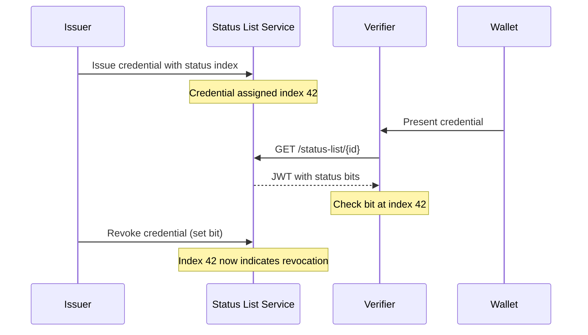

# Status Management

EUDIPLO provides comprehensive status management for issued credentials through
the OAuth Token Status List specification (RFC 9528). This allows issuers to
revoke or suspend credentials without requiring direct communication with the
credential holder.

## Overview

Status management enables credential lifecycle operations such as:

- **Revocation** - Permanently invalidate a credential
- **Suspension** - Temporarily disable a credential (can be reinstated)
- **Status verification** - Verifiers can check credential validity in real-time

Status lists are privacy-preserving: verifiers can check if a credential is
valid without learning which specific credential is being checked (beyond the
list index).

## How It Works



Each credential is assigned an index in a status list. The status list is a
compressed bit array where each bit (or group of bits) represents the status of
one credential. Verifiers fetch the status list and check the bit at the
credential's index.

## Configuration

### Environment Variables

--8<-- "docs/generated/config-status.md"

### Per-Tenant Configuration

Each tenant can override the default status list settings via the API or web
client:

```json
{
    "defaultBits": 1,
    "defaultCapacity": 100000,
    "ttl": 3600,
    "immediateUpdate": false
}
```

| Field             | Description                                                                |
| ----------------- | -------------------------------------------------------------------------- |
| `defaultBits`     | Bits per status entry (1, 2, 4, or 8). More bits allow more status values. |
| `defaultCapacity` | Maximum number of credentials per status list                              |
| `ttl`             | Time-to-live for the status list JWT in seconds                            |
| `immediateUpdate` | Whether to regenerate the JWT immediately on status changes                |

## Status List Structure

### Bits Per Status

The `bits` parameter determines how many distinct status values are possible:

| Bits | Values      | Use Case                            |
| ---- | ----------- | ----------------------------------- |
| 1    | 2 (0-1)     | Simple valid/revoked                |
| 2    | 4 (0-3)     | Valid, suspended, revoked, reserved |
| 4    | 16 (0-15)   | Multiple suspension reasons         |
| 8    | 256 (0-255) | Complex status workflows            |

### Capacity

The capacity determines how many credentials can use a single status list:

- **10,000** - Small deployments, faster updates
- **100,000** - Medium deployments (default)
- **1,000,000** - Large-scale production

Larger capacities mean larger JWT payloads but fewer status lists to manage.

## JWT Caching and TTL

Per RFC 9528, status list JWTs include time-based claims for caching:

```json
{
  "iss": "https://issuer.example.com",
  "sub": "https://issuer.example.com/status-list/abc123",
  "iat": 1704067200,
  "exp": 1704070800,
  "ttl": 3600,
  "status_list": { ... }
}
```

| Claim | Description                                |
| ----- | ------------------------------------------ |
| `iat` | Issued-at timestamp (REQUIRED)             |
| `exp` | Expiration timestamp (RECOMMENDED)         |
| `ttl` | Time-to-live hint in seconds (RECOMMENDED) |

### Regeneration Modes

EUDIPLO supports two JWT regeneration strategies:

#### Lazy Mode (Default)

The JWT is regenerated only when:

1. A verifier requests the status list AND
2. The current JWT has expired (`exp` < now)

This minimizes computation but means status changes may not be immediately
visible to verifiers until the TTL expires.

```
TTL = 1 hour
├─ 10:00 - Credential revoked (JWT not regenerated)
├─ 10:30 - Verifier checks (gets cached JWT, sees valid)
├─ 11:00 - JWT expires
└─ 11:05 - Verifier checks (new JWT generated, sees revoked)
```

#### Immediate Mode

When `immediateUpdate` is enabled, the JWT is regenerated immediately whenever
a status entry changes. This ensures verifiers always see the latest status but
increases computational overhead.

```
├─ 10:00 - Credential revoked (JWT regenerated immediately)
└─ 10:01 - Verifier checks (sees revoked)
```

!!! warning "Performance Consideration"
Immediate mode can impact performance with frequent status changes.
Consider lazy mode with shorter TTLs for high-volume scenarios.

### Choosing TTL Values

| Scenario      | Recommended TTL | Notes                            |
| ------------- | --------------- | -------------------------------- |
| High security | 5-15 minutes    | Quick propagation of revocations |
| Standard      | 1 hour          | Balance of freshness and caching |
| Low-change    | 24 hours        | Minimize server load             |

## Status Lists and Credential Configs

### Automatic Creation

When issuing a credential with status management enabled, EUDIPLO automatically:

1. Finds an available status list for the credential configuration
2. Creates a new **shared** status list if none have capacity
3. Assigns the next available index to the credential

### Capacity Exhaustion

When a status list runs out of available indexes:

**For shared lists**: EUDIPLO automatically creates a new shared status list and
continues issuance seamlessly. No manual intervention is required.

**For bound lists**: If a status list is bound to a specific credential
configuration and reaches capacity:

1. EUDIPLO will **not** automatically create a new bound list
2. It will fall back to using shared lists if available
3. If no shared lists have capacity, a new shared list is created

!!! tip "Pre-creating Bound Lists"
    If you require all credentials of a specific type to use dedicated status
    lists, pre-create multiple bound lists with sufficient capacity, or monitor
    usage and create new bound lists before reaching capacity.

### Binding to Credential Configurations

Status lists can be:

- **Shared** - Used by any credential configuration in the tenant
- **Bound** - Exclusively used by a specific credential configuration

Binding is useful when:

- Different credential types have different revocation policies
- You want separate capacity management per credential type
- Compliance requires isolated status tracking

### Certificate Pinning

By default, status list JWTs are signed with the tenant's default signing
certificate. You can pin a specific certificate to a status list for:

- Key rotation scenarios
- Compliance with specific signing requirements
- Isolation of signing keys per use case

## API Operations

The Status Management API provides endpoints for managing status lists and
updating credential status entries.

**Full API Reference**: [Status Management API](../api/openapi.md#tag/status-management)

Key operations include:

| Operation          | Description                                    |
| ------------------ | ---------------------------------------------- |
| List status lists  | Get all status lists for the tenant            |
| Get status list    | Retrieve a specific status list by ID          |
| Create status list | Create a new status list with optional binding |
| Update status list | Modify binding or certificate assignment       |
| Delete status list | Remove an empty status list                    |
| Update entry       | Change the status value at a specific index    |

### Public Status List Endpoint

The status list JWT is served at a public endpoint for verifiers:

```
GET /{tenant}/status-management/status-list/{listId}
```

This endpoint requires no authentication and returns the cached status list JWT.
Verifiers should respect the `exp` and `ttl` claims for caching.

## Web Client

The web client provides a user-friendly interface for status management:

### Status List Overview

Navigate to **Status Lists** to see all status lists with:

- Capacity and usage statistics
- JWT expiration status (Valid, Expiring, Expired)
- Bound credential configuration
- Certificate assignment

### Creating Status Lists

Click **Create** to manually create a status list with:

- Optional credential configuration binding
- Optional certificate pinning

### Configuration

Click **Settings** (⚙️) to configure tenant defaults:

- Default bits per status
- Default capacity
- TTL for JWT caching
- Immediate update mode

## Import Configuration

Status lists can be pre-created via configuration import:

**Location**: `config/{tenant}/status-lists/*.json`

```json
{
    "credentialConfigurationId": "org.iso.18013.5.1.mDL",
    "certId": "status-signing-cert"
}
```

See [Configuration Import](./configuration-import.md#status-list-configurations)
for more details.

## Best Practices

### Security

1. **Use appropriate TTLs** - Shorter for high-security credentials
2. **Monitor capacity** - Create new lists before reaching capacity
3. **Rotate signing keys** - Use certificate pinning for key rotation

### Performance

1. **Use lazy mode** for high-volume scenarios
2. **Set reasonable capacity** - Balance between list size and management overhead
3. **Cache status lists** - Verifiers should respect `exp` and `ttl` claims

### Operations

1. **Pre-create status lists** for predictable capacity planning
2. **Monitor JWT expiration** in the web client
3. **Use binding** when credential types have different lifecycles
