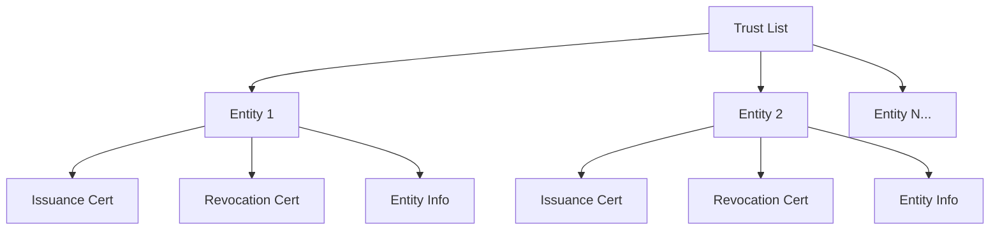
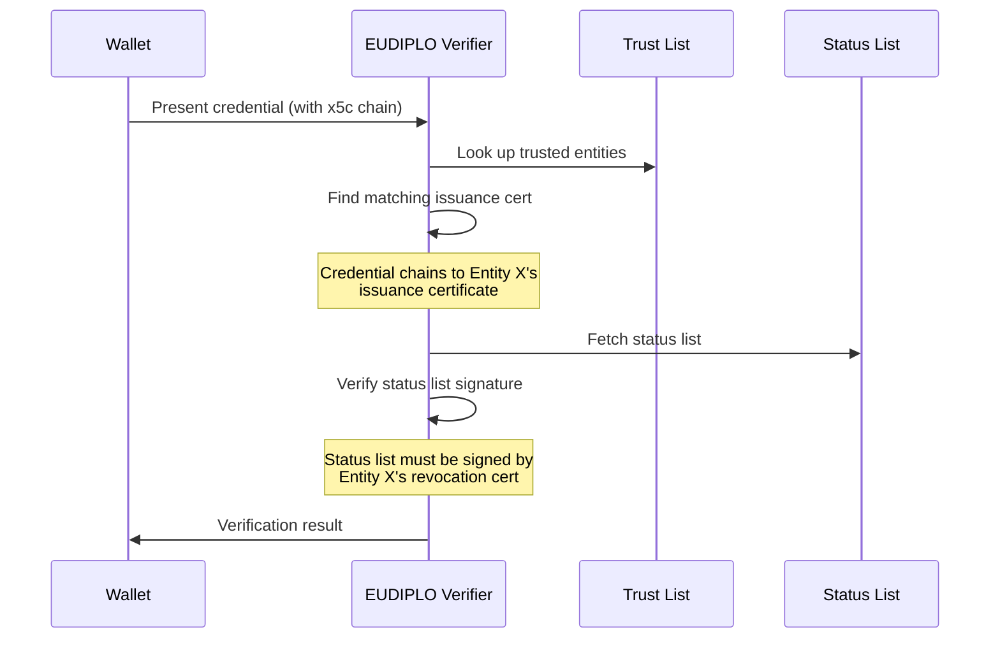

# Trust Framework

EUDIPLO implements a trust framework for credential verification based on the
ETSI TS 119 602 standard (List of Trusted Entities - LoTE). This ensures that
credentials are only accepted from authorized issuers and that revocation
information comes from the correct authority.

---

## Overview

When verifying a credential presentation, EUDIPLO needs to answer two critical
questions:

1. **Was this credential issued by a trusted entity?**
2. **Is the revocation status provided by an authorized source?**

Trust lists solve this by maintaining a registry of:

- **Issuance Certificates**: Certificates authorized to sign credentials
- **Revocation Certificates**: Certificates authorized to sign status lists

!!! important "Issuance and Revocation Certificate Pairing"

    Each trusted entity defines **both** an issuance certificate and a revocation
    certificate. When verifying a credential, EUDIPLO ensures that the status list
    is signed by the revocation certificate **from the same entity** that issued
    the credential. This prevents an attacker from using a valid issuance certificate
    with a rogue status list.

---

## Trust List Structure

A trust list in EUDIPLO follows the LoTE (List of Trusted Entities) format and
contains:

### Metadata

- **ID**: Unique identifier for the trust list
- **Description**: Human-readable description
- **Signing Certificate**: Certificate used to sign the trust list itself
- **Version/Sequence Number**: Tracks trust list updates

### Trusted Entities

Each entity represents an authorized issuer with:

- **Issuance Certificate**: Used to verify credential signatures
- **Revocation Certificate**: Used to verify status list signatures
- **Entity Information**: Name, country, contact details



---

## How Trust Verification Works

### Credential Verification Flow

When a credential is presented for verification:



### Certificate Chain Matching

EUDIPLO supports two modes for matching certificates:

1. **CA Mode**: The trust list contains CA certificates. The credential's
   certificate chain must terminate at the trusted CA.

2. **Pinned Mode**: The trust list contains end-entity certificates. The
   credential's leaf certificate must exactly match the pinned certificate.

---

## Creating Trust Lists

### Via Configuration Import

Create a JSON file in `config/{tenant}/trust-lists/`:

```json
--8<-- "assets/config/demo/trust-lists/pid.json"
```

### Via API

Use the Trust List API endpoints:

```bash
# Create a trust list
curl -X POST "${BASE_URL}/trust-list" \
  -H "Authorization: Bearer ${TOKEN}" \
  -H "Content-Type: application/json" \
  -d '{
    "id": "my-trust-list",
    "description": "Production Trust List",
    "certId": "signing-cert-id",
    "entities": [...]
  }'
```

---

## Entity Types

### Internal Entities

Reference certificates already managed in EUDIPLO:

```json
{
    "type": "internal",
    "issuerCertId": "uuid-of-issuance-cert",
    "revocationCertId": "uuid-of-revocation-cert",
    "info": {
        "name": "Organization Name",
        "country": "DE"
    }
}
```

**Use Case**: You are an **issuer** and want to publish a trust list containing
your own certificates that are already managed by EUDIPLO.

**Benefits**:

- Seamless integration with certificates managed in EUDIPLO
- Certificates are validated and linked automatically
- Easy to maintain as certificates are updated in the system

### External Entities

Include PEM certificates directly:

```json
{
    "type": "external",
    "issuerCertPem": "-----BEGIN CERTIFICATE-----\n...\n-----END CERTIFICATE-----",
    "revocationCertPem": "-----BEGIN CERTIFICATE-----\n...\n-----END CERTIFICATE-----",
    "info": {
        "name": "External Issuer",
        "country": "US"
    }
}
```

**Use Case**: You are a **verifier** and want to accept credentials from
external issuers that are not managed by your EUDIPLO instance.

**Benefits**:

- Accept credentials from third-party issuers
- No need to import external certificates into EUDIPLO's key management
- Enable cross-organization and cross-border credential acceptance

---

## Public Trust List Endpoint

Trust lists are published as signed JWTs at:

```
GET /{tenantId}/trust-list/{trustListId}
```

This allows:

- **Other verifiers** to synchronize trust information
- **Auditors** to verify the trust chain

The JWT is signed by the certificate specified in `certId` and follows the LoTE
format from ETSI TS 119 602.

---

## Best Practices

### Trust List Management

- **Use separate certificates** for issuance and revocation per entity
- **Version your trust lists** to track changes over time
- **Sign trust lists** with a dedicated certificate (not an issuance cert)
- **Document entity information** thoroughly for audit purposes

### Security Considerations

- **Protect signing keys**: The trust list signing certificate should be highly
  protected
- **Review entities carefully**: Only add thoroughly vetted issuers
- **Monitor for compromise**: Have a process to remove compromised entities
- **Use certificate expiration**: Ensure certificates have appropriate validity
  periods

### Multi-Tenant Deployments

- Each tenant can maintain their own trust lists
- Trust lists are isolated per tenant
- Consider creating shared trust lists for common issuers

---

## Integration with Presentation Verification

Trust lists are used during presentation verification to:

1. **Validate issuer trust**: Check if the credential's issuer certificate
   chains to a trusted entity
2. **Validate status list trust**: Ensure the status list is signed by the
   correct revocation certificate from the same entity
3. **Provide issuer information**: Return entity metadata (name, country) as
   part of verification results

For configuring presentation verification with trust lists, see
[Presentation Configuration](../getting-started/presentation/presentation-configuration.md).

---

## Troubleshooting

### Common Issues

**Credential verification fails with "No trusted entity match"**:

- Verify the credential's x5c chain is present
- Check that the issuer's certificate is in the trust list
- Ensure certificate thumbprints match

**Status list verification fails**:

- Verify the status list JWT has an x5c chain
- Check that the revocation certificate from the **same entity** is configured
- Ensure the status list certificate hasn't expired

**Trust list JWT is invalid**:

- Check that `certId` points to a valid signing certificate
- Verify the signing certificate hasn't expired
- Ensure the certificate has signing permissions

---

## Related Documentation

- [Configuration Import](./configuration-import.md) - Import
  trust lists via configuration files
- [Key Management](./key-management.md) - Managing certificates
  for trust lists
- [Presentation Configuration](../getting-started/presentation/presentation-configuration.md) - Configuring
  presentation verification
