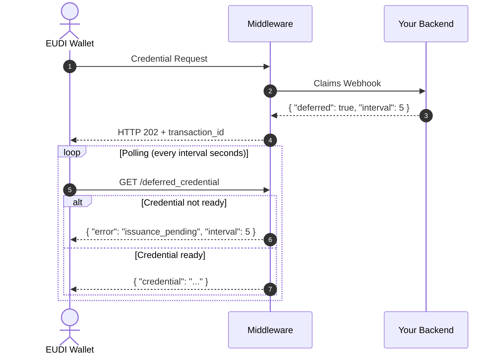

# Webhooks

EUDIPLO supports webhook endpoints that let external services actively participate in **issuance** and **presentation** flows.

While webhooks are optional, they make the overall process more dynamic—for example:

- requesting credential data from your backend service only when needed,
- notifying your system when a wallet has completed a flow, or
- **deferring credential issuance** when your backend needs time to process (e.g., KYC verification, approval workflows).

---

## Supported Webhook Scenarios

| Flow                            | Purpose                                                                  |
| ------------------------------- | ------------------------------------------------------------------------ |
| **Credential Issuance Webhook** | Dynamically provides claims during the credential request process.       |
| **Deferred Issuance Webhook**   | Signals that credential issuance should be deferred for later retrieval. |
| **Presentation Webhook**        | Receives verified claims from the wallet.                                |
| **Notification Webhook**        | Receives status updates (e.g., accepted or denied) about issuance flows. |

!!! tip "Interactive Authorization (IAE)"

    For user interactions during issuance (e.g., verifiable presentations, web-based verification), see [Interactive Authorization Endpoint](./iae.md).

---

## Example Webhook Service

A simple webhook simulator is available in the [test/webhook](https://github.com/openwallet-foundation-labs/eudiplo/tree/main/test/webhook)  
directory. It can be run locally or deployed to a Cloudflare Worker, and is a good starting point for testing webhook functionality.

---

## Webhook Configuration

A webhook configuration object defines how EUDIPLO interacts with your service.

It must include:

- `url`: The endpoint URL. EUDIPLO sends an HTTP `POST` request with JSON data.
- `auth`: (Optional) Authentication configuration.
    - `type`: Authentication type. Currently supported:
        - `apiKey` – sends a key in a request header.

### Example

```json
{
    "url": "http://localhost:8787/consume",
    "auth": {
        "type": "apiKey",
        "config": {
            "headerName": "x-api-key",
            "value": "your-api-key"
        }
    }
}
```

---

## Claims Webhook

The **claims webhook** allows EUDIPLO to fetch attributes dynamically instead of embedding them in the credential offer. This is useful if:

- claims are not known in advance, or
- you want to avoid including sensitive data in the offer for privacy reasons.

- **Pre-authenticated / Authenticated flows:**  
  Called during the **credential request**.  
  If no webhook is configured, EUDIPLO falls back to claims provided in the credential offer or defined in the credential configuration.

- **Interactive Authorization (IAE) with presentation:**  
  When using IAE with an `openid4vp_presentation` action, the webhook is called after the wallet completes the presentation.  
  EUDIPLO sends verified claims to your service, which must respond with the claims to persist in the credential.  
  This avoids your service needing to manage state between the authentication and issuance phases.  
  See [Interactive Authorization Endpoint](./iae.md) for details.

```json
{
    "claimsWebhook": {
        "url": "http://localhost:8787/process",
        "auth": {
            "type": "apiKey",
            "config": {
                "headerName": "x-api-key",
                "value": "your-api-key"
            }
        }
    }
}
```

---

## Deferred Credential Issuance

**Deferred issuance** allows your backend to signal that the credential cannot be issued immediately. This is useful when:

- Background verification is required (e.g., KYC, identity proofing)
- An approval workflow must be completed
- External data sources need time to respond
- The credential requires asynchronous processing

### How It Works

When the claims webhook returns a **deferred response**, EUDIPLO:

1. Stores the pending request with a `transaction_id`
2. Returns HTTP 202 (Accepted) to the wallet with the `transaction_id`
3. The wallet polls the **deferred credential endpoint** until the credential is ready



### Webhook Response for Deferred Issuance

To trigger deferred issuance, your webhook should return:

```json
{
    "deferred": true,
    "interval": 5
}
```

| Field      | Type    | Description                                          |
| ---------- | ------- | ---------------------------------------------------- |
| `deferred` | boolean | Set to `true` to defer the credential issuance       |
| `interval` | number  | Recommended polling interval in seconds (default: 5) |

### Completing Deferred Issuance

Once your backend has completed processing, you need to call EUDIPLO's API to provide the credential:

```bash
# Complete the deferred transaction with the credential
POST /issuer/deferred/{transactionId}/complete
Content-Type: application/json
Authorization: Bearer <your-token>

{
    "credential": "<the-issued-credential-string>"
}
```

Or, if the issuance failed:

```bash
# Mark the deferred transaction as failed
POST /issuer/deferred/{transactionId}/fail
Content-Type: application/json
Authorization: Bearer <your-token>

{
    "errorMessage": "KYC verification failed"
}
```

### Deferred Credential Errors

When the wallet polls the deferred credential endpoint, it may receive:

| Error Code               | HTTP Status | Description                                           |
| ------------------------ | ----------- | ----------------------------------------------------- |
| `issuance_pending`       | 400         | Credential is still being processed. Retry later.     |
| `invalid_transaction_id` | 400         | Transaction not found, expired, or already retrieved. |

The `issuance_pending` error includes an `interval` field indicating when to retry:

```json
{
    "error": "issuance_pending",
    "error_description": "The credential issuance is still pending",
    "interval": 5
}
```

### Transaction Lifecycle

Deferred transactions have the following states:

| Status      | Description                                      |
| ----------- | ------------------------------------------------ |
| `pending`   | Waiting for your backend to complete processing  |
| `ready`     | Credential is ready for wallet retrieval         |
| `retrieved` | Wallet has successfully retrieved the credential |
| `expired`   | Transaction expired (default: 24 hours)          |
| `failed`    | Issuance failed due to an error                  |

!!! info "Transaction Expiry"

    Deferred transactions expire after 24 hours by default. Expired transactions are automatically cleaned up hourly.

---

## Notification Webhook

The **notification webhook** receives the outcome of the issuance process (e.g., accepted or denied).  
This confirms that the wallet has received and accepted the credential.

```json
{
    "notifyWebhook": {
        "url": "http://localhost:8787/notify",
        "auth": {
            "type": "apiKey",
            "config": {
                "headerName": "x-api-key",
                "value": "your-api-key"
            }
        }
    }
}
```

If no notification webhook is configured, you can fetch the session result by querying the `/session` endpoint with the `sessionId`.

---

## Presentation Webhook

The **presentation webhook** receives verified claims from the wallet after a presentation flow completes.

```json
{
    "webhook": {
        "url": "http://localhost:8787/notify",
        "auth": {
            "type": "apiKey",
            "config": {
                "headerName": "x-api-key",
                "value": "your-api-key"
            }
        }
    }
}
```

### Webhook Request Format

EUDIPLO sends an HTTP `POST` request with the following structure:

- `credentials`: Array of credential objects. Each includes:
    - `id`: The ID of the DCQL query.
    - `values`: The claims presented by the wallet.
        - SD-JWT VC–specific fields (e.g., `cnf`, `status`) are removed for simplicity.
    - `error`: Present instead of `values` if verification failed.
- `session`: The session ID identifying the request.

```json
{
    "credentials": [
        {
            "id": "pid",
            "values": {
                "iss": "https://service.eudi-wallet.dev",
                "iat": 1751884150,
                "vct": "https://service.eudi-wallet.dev/credentials/vct/pid",
                "address": {
                    "locality": "KÖLN",
                    "postal_code": "51147",
                    "street_address": "HEIDESTRAẞE 17"
                }
            }
        },
        {
            "id": "citizen",
            "error": "Credential verification failed: invalid signature"
        }
    ],
    "session": "a6318799-dff4-4b60-9d1d-58703611bd23"
}
```

!!! info

    Requests always use `Content-Type: application/json`. A retry mechanism is not yet implemented—if a webhook fails, the process halts. Retry support may be added in the future.

---

### Webhook Response Format

A response is required for:

- **IAE with presentation** webhooks, and
- **issuance** webhooks.

The response must be a JSON object keyed by the credential configuration ID. Each entry contains the **claims** to issue.

### Example Response

Issuing a credential with ID `citizen`:

```json
{
    "citizen": {
        "town": "BERLIN"
    }
}
```

This response is injected into the issuance flow to create the final credential.
