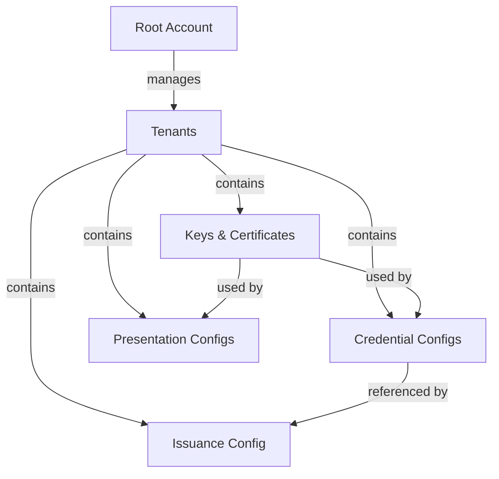

# First Steps After Installation

You've started EUDIPLO—now what? This guide walks you through the initial setup
to issue your first credential using the **Web Client**.

!!! info "Prerequisites"

    Complete the [Quick Start](./quick-start.md) guide first. You should have EUDIPLO
    running with both backend and client:

    - Backend: http://localhost:3000
    - Web Client: http://localhost:4200

!!! tip "Prefer API access?"

    This guide focuses on the Web Client for simplicity. For API-based setup,
    see the [API Reference](../api/index.md) and [Issuance API](./issuance/index.md).

---

## Understanding the Setup

EUDIPLO uses a hierarchical structure:



| Concept                 | Description                                                                                                           |
| ----------------------- | --------------------------------------------------------------------------------------------------------------------- |
| **Root Account**        | The default admin account. Used to create and manage tenants.                                                         |
| **Tenant**              | An isolated workspace with its own keys, credentials, and configurations.                                             |
| **Keys & Certificates** | Cryptographic keys for signing credentials and certificates for verifier authentication. Auto-generated on first use. |
| **Credential Config**   | Defines what a credential looks like (claims, format, display).                                                       |
| **Issuance Config**     | Groups credential configs and defines issuer metadata.                                                                |
| **Presentation Config** | Defines what credentials to request from wallets during verification.                                                 |

---

## Step 1: Login as Root

1. Open the Web Client at **<http://localhost:4200>**
2. Enter:
    - **EUDIPLO Instance**: `http://localhost:3000`
    - **Client ID**: Your configured `AUTH_CLIENT_ID`
    - **Client Secret**: Your configured `AUTH_CLIENT_SECRET`
3. Click **Login**

!!! warning "Credentials are REQUIRED"

    You must set these environment variables before starting the service:

    ```env
    AUTH_CLIENT_ID=your-client-id
    AUTH_CLIENT_SECRET=your-client-secret
    JWT_SECRET=your-32-character-minimum-secret
    ```

    The application will fail to start without these values. See [Authentication](../api/authentication.md) for details.

---

## Step 2: Create Your First Tenant

Tenants provide isolation—each tenant has its own keys, credentials, and configurations.

1. Navigate to **Tenants** in the sidebar
2. Click **+ Create Tenant**
3. Fill in:
    - **ID**: `my-org` (unique identifier for the tenant)
    - **Name**: `My Organization`
    - **Description**: Optional description
    - **Roles**: Select all roles for a full setup
4. Click **Save**
5. A dialog appears showing the **client credentials** for the new tenant:
    - **Save the secret now!** It won't be shown again.
    - Use the **Copy** buttons to save the credentials
    - Click **Login as this Client** to switch to the new tenant immediately

!!! warning "Save your credentials!"

    Client secrets are securely hashed and cannot be retrieved later.
    If you lose the secret, use the **Rotate Secret** button in the client list
    to generate a new one.

---

## Step 3: Create a Credential Configuration

Now define what your credential will contain and how it looks.

1. Navigate to **Issuance** → **Credential Configs** in the sidebar
2. Click **+ Create**
3. Click **Load Template** (top-right corner) and select a template like `PID (SD-JWT VC)`

!!! tip "Templates save time"

    Templates provide pre-configured credential types with proper claims, display
    settings, and formats. They're the fastest way to get started!

4. Review and adjust the configuration as needed
5. Click **Save**

---

## Step 4: Configure Issuance Settings

The issuance configuration defines how your issuer presents itself to wallets.

1. Navigate to **Issuance** → **Issuance Config**
2. Configure:
    - **Display Name**: `My Issuer`
    - **DPoP Required**: **Disabled** ⚠️
    - **Batch Size**: `1`
3. Click **Save**

!!! warning "DPoP Compatibility"

    Keep **DPoP Required** disabled for maximum wallet compatibility.
    Many wallets don't support DPoP yet. You can enable it later for
    additional security once you've verified your target wallets support it.

---

## Step 5: Issue Your First Credential! 🎉

Now create a credential offer and send it to a wallet.

1. Navigate to **Issuance** → **Sessions**
2. Click **+ New Offer**
3. Configure the offer:
    - **Credential**: Select `identity-credential`
    - **Flow**: Select `Pre-authorized` (simplest flow, no user authentication)
4. Enter the claim values:

    ```json
    {
        "given_name": "John",
        "family_name": "Doe",
        "birthdate": "1990-01-15"
    }
    ```

5. Click **Create Offer**
6. A **QR code** appears—scan it with a compatible wallet!

!!! tip "Testing with a wallet"

    See [Wallet Compatibility](./wallet-compatibility.md) for a list of wallets
    that work with EUDIPLO. The EUDI Reference Wallet and Sphereon Wallet are
    good options for testing.

---

## What's Next?

You've successfully issued your first credential! Here's what to explore next:

| Goal                             | Guide                                                              |
| -------------------------------- | ------------------------------------------------------------------ |
| Verify credentials from wallets  | [Presentation Guide](./presentation/index.md)                      |
| Customize credential appearance  | [Credential Configuration](./issuance/credential-configuration.md) |
| Integrate with your backend      | [Webhooks](../architecture/webhooks.md)                            |
| Set up for production            | [Deployment Guide](../deployment/index.md)                         |
| Add more security (external IdP) | [Authentication](../api/authentication.md)                         |

---

## Troubleshooting

### "Login failed" error

- Remove trailing `/` from the EUDIPLO instance URL
- Check that EUDIPLO is running: `curl http://localhost:3000/health`
- Verify credentials are correct

### Wallet shows error during issuance

- Ensure **DPoP Required** is disabled in Issuance Config
- Check [Wallet Compatibility](./wallet-compatibility.md) for supported wallets

### "No credential configurations found"

- Create a credential configuration first (Step 3)
- Make sure you're logged in as the correct tenant

### Keys not found

- Keys are auto-generated on first use
- Check the **Keys** section in the sidebar to see available keys
