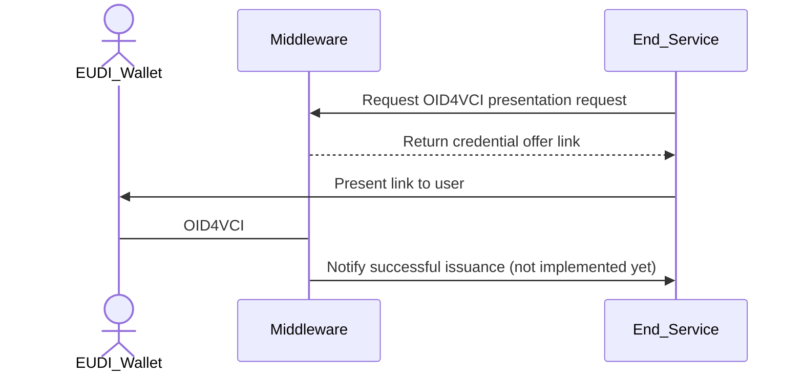

# Configuring Credential Issuance Flows

Issuance flow files define how a credential should be generated, signed, and
formatted. EUDIPLO uses a tenant-based architecture where each tenant has
isolated configuration.

The issuance system uses a **two-layer configuration approach**:

1. **Credential Configurations** - Define the structure, format, and metadata of
   individual credentials
2. **Issuance Configurations** - Define which credentials to issue together and
   authentication requirements

---

## API Endpoints

The system uses two separate endpoints for the two-layer configuration:

### Credential Configurations

To manage individual credential configurations, use the
`/issuer-management/credentials` endpoint. This endpoint handles the definition
of credential types, their formats, claims, and display properties.

### Issuance Configurations

To manage issuance flows (which credentials to issue together and authentication
requirements), use the `/issuer-management/issuance` endpoint. This endpoint
handles grouping credentials and defining authorizations or webhooks.

Based on your passed JWT, both endpoints will be scoped to the tenant ID of the
token. The configurations are internally stored in a database.

Via the `/issuer-management/offer` endpoint you can start the issuance flow for
a specific issuance configuration. Some of the defined information can be
overridden when creating the credential offer.

---

## Credential Issuance Flow

This flow describes how a backend service starts an issuance flow of an
attestation. EUDIPLO creates the OID4VCI request and handles the protocol flow
with the wallet.



---

## Configuration Structure

### Credential Configuration

Credential configurations define the structure and properties of individual
credentials. Each credential type has its own configuration file.

**Example Credential Configuration (PID):**

```json
{
    "config": {
        "format": "dc+sd-jwt",
        "vct": "https://sd-jwt.com",
        "proof_types_supported": {
            "jwt": {
                "proof_signing_alg_values_supported": ["ES256"]
            }
        },
        "credential_signing_alg_values_supported": ["ES256"],
        "cryptographic_binding_methods_supported": ["jwk"],
        "display": [
            {
                "name": "PID",
                "background_color": "#FFFFFF",
                "background_image": {
                    "uri": "<PUBLIC_URL>/bdr/credential.png",
                    "url": "<PUBLIC_URL>/bdr/credential.png"
                },
                "description": "PID Credential",
                "locale": "en-US",
                "logo": {
                    "uri": "<PUBLIC_URL>/issuer.png",
                    "url": "<PUBLIC_URL>/issuer.png"
                },
                "text_color": "#000000"
            }
        ]
    },
    "claims": {
        "issuing_country": "DE",
        "issuing_authority": "DE",
        "given_name": "ERIKA",
        "family_name": "MUSTERMANN",
        "birthdate": "1964-08-12",
        "place_of_birth": {
            "locality": "BERLIN"
        },
        "address": {
            "locality": "KÖLN",
            "postal_code": "51147",
            "street_address": "HEIDESTRAẞE 17"
        }
    },
    "disclosureFrame": {
        "_sd": [
            "issuing_country",
            "issuing_authority",
            "given_name",
            "family_name",
            "birthdate",
            "place_of_birth",
            "address"
        ],
        "address": {
            "_sd": ["locality", "postal_code", "street_address"]
        }
    },
    "vct": {},
    "schema": {
        "$schema": "https://json-schema.org/draft/2020-12/schema",
        "type": "object",
        "properties": {
            "vct": { "type": "string" },
            "iss": { "type": "string" },
            "nbf": { "type": "number" },
            "exp": { "type": "number" },
            "cnf": { "type": "object" },
            "status": { "type": "object" },
            "given_name": { "type": "string" },
            "family_name": { "type": "string" }
        },
        "required": ["iss", "vct", "cnf", "given_name", "family_name"]
    }
}
```

**Credential Configuration Fields:**

- `config`: **REQUIRED** - Entry for
  [credential_configuration_supported](https://openid.net/specs/openid-4-verifiable-credential-issuance-1_0.html#name-credential-issuer-metadata:~:text=the%20logo%20image.-,credential_configurations_supported,-%3A%20REQUIRED.%20Object%20that).
  The name of the file will be used as the key in the configuration.
- `claims`: **OPTIONAL** - Static claims to include in the credential. Can be
  overridden by webhook responses or claims passed during credential offer.
- `disclosureFrame`: **OPTIONAL** - Defines which claims should be selectively
  disclosable in SD-JWT format.
- `vct`: **OPTIONAL** -
  [VC Type Metadata](https://www.ietf.org/archive/id/draft-ietf-oauth-sd-jwt-vc-09.html#name-sd-jwt-vc-type-metadata)
  provided via the `/credentials/vct/{id}` endpoint.
- `schema`: **OPTIONAL** -
  [Schema Type Metadata](https://www.ietf.org/archive/id/draft-ietf-oauth-sd-jwt-vc-09.html#name-schema-type-metadata)
  to validate the claims before issuance. The schema will be added into the vct
  values.

### Issuance Configuration

Issuance configurations define which credentials to issue together and any
authentication requirements.

**Example Issuance Configuration (Citizen Pass):**

```json
{
    "presentation_during_issuance": {
        "type": "pid",
        "webhook": {
            "url": "http://localhost:8787/process"
        }
    },
    "credentialConfigs": ["citizen"]
}
```

**Issuance Configuration Fields:**

- `credentialConfigs`: **REQUIRED** - Array of credential configuration IDs to
  issue together.
- `presentation_during_issuance`: **OPTIONAL** - If set, requires user to
  present a credential before issuance
    - `type`: **REQUIRED** - ID of the presentation request to use
    - `webhook`: **OPTIONAL** - URL to send the presentation response to. If not
      provided, it will use the passed claims during the credential offer link
      generation or the static claims defined in the credential configuration.

---

## Example Credential Configuration

## Display Configuration

TODO: needs to be updated

This display information gets included into the
[credential issuer metadata](https://openid.net/specs/openid-4-verifiable-credential-issuance-1_0.html#name-credential-issuer-metadata:~:text=2%20or%20greater.-,display,-%3A%20OPTIONAL.%20A%20non).

> `<PUBLIC_URL>` will be dynamically replaced at runtime with your public URL
> together with the tenant ID.

---

## Passing Claims

There are three options to pass claims for the credential. They are handled in
the following order:

1. **Webhook response** during presentation during issuance (highest priority)
2. **Claims field** in the credential offer request
3. **Static claims** in the credential configuration (lowest priority)

If no claims are provided, the credential will be issued with an empty claims
set. Claims will not be merged with other claims from e.g. the offer or the
static defined ones - the higher priority source completely overrides lower
priority sources.

## Configuration Management

### Creating Credential Configurations

Credential configurations are managed via the `/issuer-management/credentials`
endpoint:

```bash
curl -X 'POST' \
  'http://localhost:3000/issuer-management/credentials' \
  -H 'accept: application/json' \
  -H 'Authorization: Bearer eyJhb...npoNk' \
  -H 'Content-Type: application/json' \
  -d '{
    "id": "pid",
    "config": {
      "format": "dc+sd-jwt",
      "vct": "https://sd-jwt.com",
      "proof_types_supported": {
        "jwt": {
          "proof_signing_alg_values_supported": ["ES256"]
        }
      },
      "credential_signing_alg_values_supported": ["ES256"],
      "cryptographic_binding_methods_supported": ["jwk"],
      "display": [...]
    },
    "claims": {...},
    "disclosureFrame": {...}
  }'
```

### Creating Issuance Configurations

Issuance configurations are managed via the `/issuer-management/issuance`
endpoint:

```bash
curl -X 'POST' \
  'http://localhost:3000/issuer-management/issuance' \
  -H 'accept: application/json' \
  -H 'Authorization: Bearer eyJhb...npoNk' \
  -H 'Content-Type: application/json' \
  -d '{
    "id": "citizen-with-pid-verification",
    "presentation_during_issuance": {
      "type": "pid",
      "webhook": {
        "url": "http://localhost:8787/process"
      }
    }
  }'
```

## Creating a Credential Offer

To start the issuance flow, you need to create a credential offer using an
**issuance configuration ID**. This is done by calling the
`/issuer-management/offer` endpoint. Via the `response_type` parameter, you can
specify how the response should be formatted:

- `uri`: Returns a URI that the user can open in their wallet to start the
  issuance flow.
- `qrcode`: Returns a QR code that the user can scan with their wallet to start
  the issuance flow.

While the `qrcode` is good for easy testing with the Swagger UI, the `uri` is
recommended to also receive the session ID in the response that is needed to
fetch information about the session later on.

```bash
curl -X 'POST' \
  'http://localhost:3000/issuer-management/offer' \
  -H 'accept: application/json' \
  -H 'Authorization: Bearer eyJhb...npoNk' \
  -H 'Content-Type: application/json' \
  -d '{
  "response_type": "uri",
  "credentialConfigurationIds": [
    "citizen-with-pid-verification"
  ]
}'
```

**Note:** The `credentialConfigurationIds` field now expects **issuance
configuration IDs**, not individual credential IDs. The issuance configuration
will determine which credentials are actually issued.

When there is no issuance configuration with the provided ID, the service will
return an error.

## Revoking Credentials

To simply the revocation of credentials, the service will persist the indexes of
the status list together with the session data. No other personal data is
stored, just

- session ID
- status list URL
- status list index

Sessions can be revoked via the `/session/revoke` endpoint like

```bash
curl -X 'POST' \
  'http://localhost:3000/session/revoke' \
  -H 'accept: */*' \
  -H 'Authorization: Bearer eyJhb...npoNk' \
  -H 'Content-Type: application/json' \
  -d '{
  "sessionId": "59d22466-b403-4b37-b1d0-20163696ade7",
  "credentialConfigurationId": "pid",
  "status": 1
}'
```

If no `credentialConfigurationId` is provided, the revocation will be applied to
all credentials of the session. The update to the status list will be performed
immediately after the request and the updates status list will be available.
