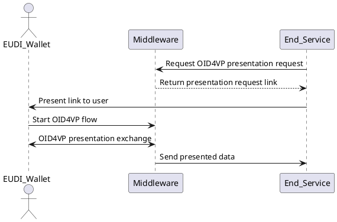

# Configuring Credential Issuance Flows

Issuance flow files define how a credential should be generated, signed, and formatted. These JSON files are stored in:

```string
config/issuance/{id}.json
```

Each file represents a specific credential type or use case.

---

## 🔍 Credential Presentation Flow

This flow describes how a backend service requests a credential presentation (e.g., to authorize a user or verify an attribute). EUDIPLO creates the OID4VP request and handles the protocol flow with the wallet.



---

## ✅ Example Credential Configuration

```json
{
  "config": {
    "format": "dc+sd-jwt",
    "vct": "https://sd-jwt.com",
    "proof_types_supported": {
      "jwt": {
        "proof_signing_alg_values_supported": ["ES256"]
      }
    },
    "credential_signing_alg_values_supported": ["ES256"],
    "cryptographic_binding_methods_supported": ["jwk"],
    "display": [
      {
        "name": "Citizen Pass",
        "background_color": "#FFFFFF",
        "background_image": {
          "uri": "<CREDENTIAL_ISSUER>/mainhall/credential.png",
          "url": "<CREDENTIAL_ISSUER>/mainhall/credential.png"
        },
        "description": "A pass for this citizen",
        "locale": "en-US",
        "logo": {
          "uri": "<CREDENTIAL_ISSUER>/issuer.png",
          "url": "<CREDENTIAL_ISSUER>/issuer.png"
        },
        "text_color": "#000000"
      }
    ]
  },
  "presentation_during_issuance": {
    "type": "pid",
    "webhook": "http://localhost:3001/process"
  },
  "claims": {
    "town": "Berlin"
  },
  "disclosureFrame": {},
  "vct": {
    "name": "Betelgeuse Education Credential - Preliminary Version",
    "description": "This is our development version of the education credential. Don't panic.",
    "extends": "https://galaxy.example.com/galactic-education-credential-0.9",
    "extends#integrity": "sha256-9cLlJNXN-TsMk-PmKjZ5t0WRL5ca_xGgX3c1VLmXfh-WRL5"
  },
  "schema": {
    "$schema": "https://json-schema.org/draft/2020-12/schema",
    "type": "object",
    "properties": {
      "vct": { "type": "string" },
      "iss": { "type": "string" },
      "nbf": { "type": "number" },
      "exp": { "type": "number" },
      "cnf": { "type": "object" },
      "status": { "type": "object" },
      "town": { "type": "string" }
    },
    "required": ["iss", "vct", "cnf", "town"]
  }
}
```

---

## 📌 Field Breakdown

| Field                         | Description                                                              |
|-------------------------------|--------------------------------------------------------------------------|
| `config`                      | Credential metadata and wallet UI display info                          |
| `presentation_during_issuance` | If set, requires user to present a credential before issuance            |
| `claims`                      | Static claims to include in the credential                              |
| `vct`                         | Describes the Verifiable Credential Type                                |
| `schema`                      | JSON Schema defining the structure and validation of the credential      |

> 🧠 `<CREDENTIAL_ISSUER>` will be dynamically replaced at runtime with your proxy URL.

---

## 🧪 How to Test

1. Place your file in `config/credentials/`
2. Check it is loaded via `GET /credentials/config`
3. Trigger issuance via `/vci/offer`
