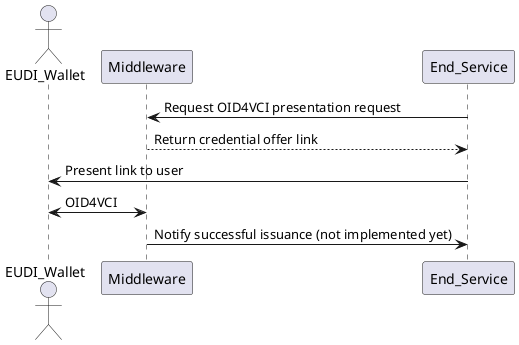

# Configuring Credential Issuance Flows

Issuance flow files define how a credential should be generated, signed, and
formatted. EUDIPLO uses a tenant-based architecture where each tenant has
isolated configuration.

---

## API Endpoints

To manage the configs for issuance, you need to interact with the
`/issuer-management` endpoint. Based on your passed JWT, the endpoint will be
scoped to the tenant ID of the token. The configurations are internally stored
in a database.

Via this endpoint you are also able to start the issuance flow for a specific
flow configuration.

---

## Credential Issuance Flow

This flow describes how a backend service starts an issuance flow of an
attestation. EUDIPLO creates the OID4VCI request and handles the protocol flow
with the wallet.



---

## Example Credential Configuration

```json
{
    "config": {
        "format": "dc+sd-jwt",
        "vct": "https://sd-jwt.com",
        "proof_types_supported": {
            "jwt": {
                "proof_signing_alg_values_supported": ["ES256"]
            }
        },
        "credential_signing_alg_values_supported": ["ES256"],
        "cryptographic_binding_methods_supported": ["jwk"],
        "display": [
            {
                "name": "Citizen Pass",
                "background_color": "#FFFFFF",
                "background_image": {
                    "uri": "<PUBLIC_URL>/mainhall/credential.png",
                    "url": "<PUBLIC_URL>/mainhall/credential.png"
                },
                "description": "A pass for this citizen",
                "locale": "en-US",
                "logo": {
                    "uri": "<PUBLIC_URL>/issuer.png",
                    "url": "<PUBLIC_URL>/issuer.png"
                },
                "text_color": "#000000"
            }
        ]
    },
    "presentation_during_issuance": {
        "type": "pid",
        "webhook": {
            "url": "http://localhost:8787/process"
        }
    },
    "claims": {
        "town": "Berlin"
    },
    "disclosureFrame": {},
    "vct": {
        "name": "Betelgeuse Education Credential - Preliminary Version",
        "description": "This is our development version of the education credential. Don't panic.",
        "extends": "https://galaxy.example.com/galactic-education-credential-0.9",
        "extends#integrity": "sha256-9cLlJNXN-TsMk-PmKjZ5t0WRL5ca_xGgX3c1VLmXfh-WRL5"
    },
    "schema": {
        "$schema": "https://json-schema.org/draft/2020-12/schema",
        "type": "object",
        "properties": {
            "vct": { "type": "string" },
            "iss": { "type": "string" },
            "nbf": { "type": "number" },
            "exp": { "type": "number" },
            "cnf": { "type": "object" },
            "status": { "type": "object" },
            "town": { "type": "string" }
        },
        "required": ["iss", "vct", "cnf", "town"]
    }
}
```

**Field Breakdown**

- `config`: REQUIRED: entry for
  [credential_configuration_supported](https://openid.net/specs/openid-4-verifiable-credential-issuance-1_0.html#name-credential-issuer-metadata:~:text=the%20logo%20image.-,credential_configurations_supported,-%3A%20REQUIRED.%20Object%20that).
  The name of the file will be used as the key in the configuration.
- `presentation_during_issuance`: If set, requires user to present a credential
  before issuance
    - `type`: REQUIRED: id of the presentation request to use
    - `webhook`: OPTIONAL: URL to send the presentation response to. If not
      provided, it will use the passed claims during the credential offer link
      generation or the static claims defined in the `claims` field.
- `claims`: OPTIONAL: Static claims to include in the credential. Will be
  overridden by the webhook response for presentation during issuance or when
  passed during the credential offer request.
- `vct`:
  [VC Type Metadata](https://www.ietf.org/archive/id/draft-ietf-oauth-sd-jwt-vc-09.html#name-sd-jwt-vc-type-metadata)
  provided via the `/credentials/vct/{id}` endpoint.
- `schema`:
  [Schema Type Metadata](https://www.ietf.org/archive/id/draft-ietf-oauth-sd-jwt-vc-09.html#name-schema-type-metadata)
  to validate the claims before issuance.

> `<PUBLIC_URL>` will be dynamically replaced at runtime with your public URL
> together with with the tenant ID.

---

## Display Configuration

TODO: needs to be updated

This display information gets included into the
[credential issuer metadata](https://openid.net/specs/openid-4-verifiable-credential-issuance-1_0.html#name-credential-issuer-metadata:~:text=2%20or%20greater.-,display,-%3A%20OPTIONAL.%20A%20non).

---

## Passing Claims

There are three options to pass claims for the credential. They are handled in
the following order:

- via webhook response during presentation during issuance
- via the `claims` field in the credential offer request
- via static claims in the `claims` field of the credential configuration

If no claims are provided, the credential will be issued with an empty claims
set. Claims will not be merged with other claims from e.g. the offer or the
static defined ones.

## Creating a Credential Offer

To start the issuance flow, you need to create a credential offer. This is done
by calling the `/issuer-management/offer` endpoint. Via the `response_type`
parameter, you can specify how the response should be formatted:

- `uri`: Returns a URI that the user can open in their wallet to start the
  issuance flow.
- `qrcode`: Returns a QR code that the user can scan with their wallet to start
  the issuance flow.

While the `qrcode` is good for easy testing with the Swagger UI, the `uri` is
recommended to also receive the session ID in the response that is needed to
fetch information about the session later on.

```bash
curl -X 'POST' \
  'http://localhost:3000/issuer-management/offer' \
  -H 'accept: application/json' \
  -H 'Authorization: Bearer eyJhb...npoNk' \
  -H 'Content-Type: application/json' \
  -d '{
  "response_type": "uri",
  "credentialConfigurationIds": [
    "citizen"
  ]
}'
```

When there is no config with the provided ID, the service will return an error.

## Revoking Credentials

To simply the revocation of credentials, the service will persist the indexes of
the status list together with the session data. No other personal data is
stored, just

- session ID
- status list URL
- status list index

Sessions can be revoked via the `/session/revoke` endpoint like

```bash
curl -X 'POST' \
  'http://localhost:3000/session/revoke' \
  -H 'accept: */*' \
  -H 'Authorization: Bearer eyJhb...npoNk' \
  -H 'Content-Type: application/json' \
  -d '{
  "sessionId": "59d22466-b403-4b37-b1d0-20163696ade7",
  "credentialConfigurationId": "pid",
  "status": 1
}'
```

If no `credentialConfigurationId` is provided, the revocation will be applied to
all credentials of the session. The update to the status list will be performed
immediately after the request and the updates status list will be available.
