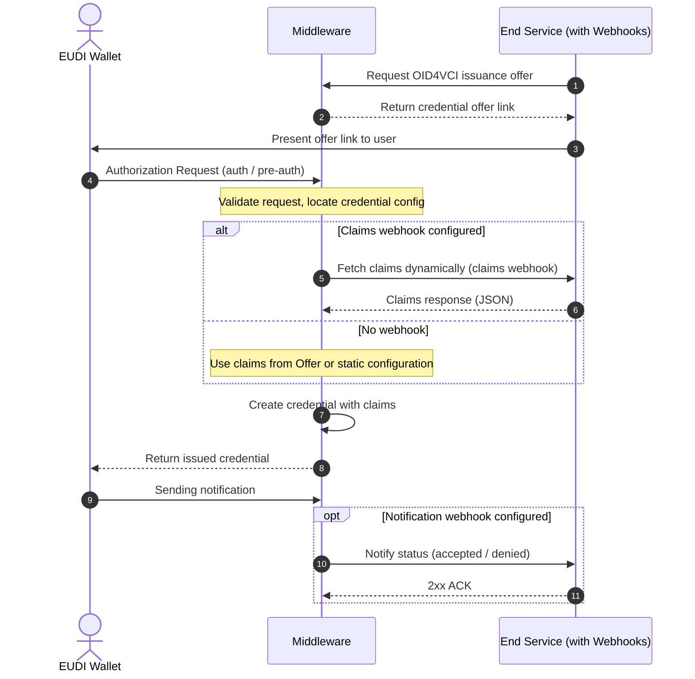

# Configuring Credential Issuance Flows

The issuance system uses a **two-layer configuration approach**:

1. **Credential Configurations** - Define the structure, format, and metadata of
   individual credentials
2. **Issuance Configuration** - Define the issuance configuration that get used to
   group multiple credentials and publish the issuer metadata

---

## API Endpoints

The system uses two separate endpoints for the two-layer configuration:

### Credential Configurations

To manage individual credential configurations, use the
`/issuer/credentials` endpoint. This endpoint handles the definition
of credential types, their formats, claims, and display properties.

### Issuance Configuration

The endpoints to manage issuance configuration can be found in the [API documentation](../../api/openapi.md#issuer) section.

Based on your passed access token, endpoints will be scoped to the tenant ID of the
token. You also need the `issuance:manage` role to access these endpoints.
The configurations are internally stored in a database.

### Creating Credential Offers

Via the [credential offer endpoint](../../api/openapi.md#post-issueroffer) you can create a credential offer that can be presented to the user.
When creating an offer, you can:

1. **Define the flow** - Either go with the pre authorized flow or require user
   authentication via the authorization code flow
2. **Provide credentials** - Use `credentialConfigurationIds` to specify which
   credentials to issue from the issuance configuration
3. **Optionally override claims** - Use the `values` parameter to provide custom
   claims for specific credentials
4. **Optionally pass claim webhooks** - Use the `claimsWebhook` parameter to
   dynamically fetch claims during the issuance flow
5. **Optionally pass notification webhooks** - Use the `notifyWebhook` parameter to
   get notified about issuance status changes

---

## Credential Issuance Flow

This flow describes how a backend service starts an issuance flow of an
attestation. EUDIPLO creates the OID4VCI request and handles the protocol flow
with the wallet. It also shows the interactions with [webhooks](../../architecture/webhooks.md) when they are configured.

The response with the credential offer link will also provide the session ID. It is included in the requests from the optional webhooks to identify the specific issuance flow. You can also use the id to query the issuance status at the API.

---

## Documentation Structure

This issuance documentation is organized into the following sections:

- **[Credential Configuration](credential-configuration.md)** - Learn how to
  define individual credential types, their structure, claims, and display
  properties
- **[Issuance Configuration](issuance-configuration.md)** - Understand how to
  create issuance configurations that group multiple credentials and define
  issuance parameters such as authorization and webhooks

---

## Quick Start

For a quick start, follow these steps:

1. **Create a credential configuration** - Define your credential type using the
   [Credential Configuration](credential-configuration.md) guide
2. **Create an issuance configuration** - Define the issuance configuration using
   the [Issuance Configuration](issuance-configuration.md) guide
3. **Issue credentials** - Start the issuance flow by creating credential offers

---

## Passing Claims

EUDIPLO provides multiple methods to pass claims (data) for credentials during issuance, with a clear priority system that determines which claims are used.

### Priority Order

Claims are resolved in the following priority order (highest to lowest):

1. **Offer-level webhook** - Webhook specified in the credential offer
2. **Offer-level static claims** - Claims specified in the credential offer
3. **Configuration-level webhook** - Webhook defined in the credential configuration
4. **Configuration-level static claims** - Claims defined in the credential configuration

!!! warning "Claims are not merged"

    Higher priority sources completely override lower priority sources - claims are not merged. If an offer-level webhook is provided, all configuration-level claims will be entirely ignored.

For a detailed explanation of the claims priority system and how to configure each method, see the [Fetching Claims](credential-configuration.md#fetching-claims) section in the Credential Configuration documentation.

### When to Use Each Method

- **Configuration-level static claims** - Default values for all credentials of this type, fixed metadata (e.g., issuing country, authority)
- **Configuration-level webhook** - Dynamic claims based on authentication context, personalized credentials requiring real-time data
- **Offer-level static claims** - Claims known at offer creation time, overriding specific values for individual issuances
- **Offer-level webhook** - Custom data source per offer, testing different webhook endpoints
