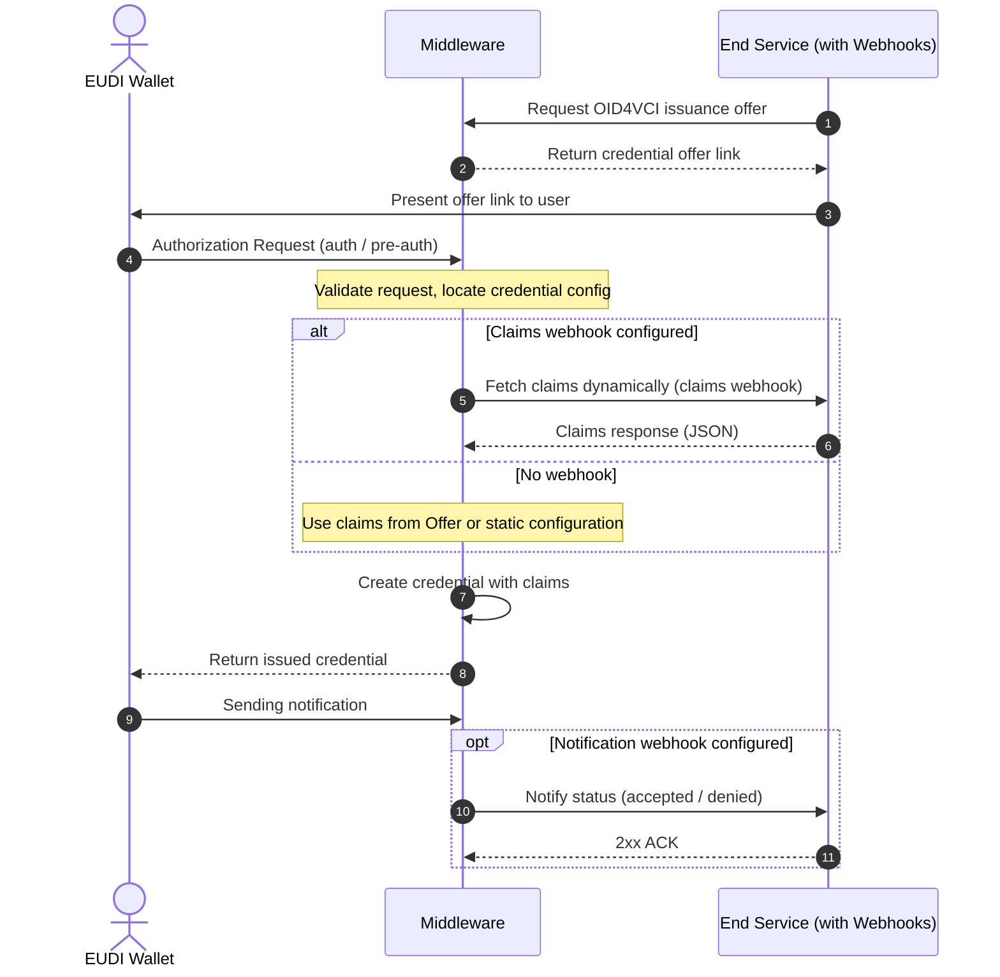

# Configuring Credential Issuance Flows

Issuance flow files define how a credential should be generated, signed, and
formatted. EUDIPLO uses a tenant-based architecture where each tenant has
isolated configuration.

The issuance system uses a **two-layer configuration approach**:

1. **Credential Configurations** - Define the structure, format, and metadata of
   individual credentials
2. **Issuance Configurations** - Define which credentials to issue together and
   authentication requirements

Both configurations have a _many-to-many_ relationship, which means a defined
credential can be used in multiple issuance configurations.

---

## API Endpoints

The system uses two separate endpoints for the two-layer configuration:

### Credential Configurations

To manage individual credential configurations, use the
`/issuer-management/credentials` endpoint. This endpoint handles the definition
of credential types, their formats, claims, and display properties.

### Issuance Configurations

To manage issuance flows (which credentials to issue together and authentication
requirements), use the `/issuer-management/issuance` endpoint. This endpoint
handles grouping credentials and defining authorizations or webhooks.

Based on your passed access token, both endpoints will be scoped to the tenant ID of the
token. You also need the `issuance:manage` role to access these endpoints.
The configurations are internally stored in a database.

### Creating Credential Offers

Via the `/issuer-management/offer` endpoint you can start the issuance flow for
a specific issuance configuration. The credential offer process works as
follows:

1. **Provide an `issuanceId`** - This specifies which issuance configuration to
   use as the base
2. **Optionally override credentials** - Use `credentialConfigurationIds` to
   override which specific credentials are issued
3. **Optionally override claims** - Use the `values` parameter to provide custom
   claims for specific credentials

The issuance configuration defines the default credentials to issue and
authentication requirements, but these can be customized per offer.

---

## Credential Issuance Flow

This flow describes how a backend service starts an issuance flow of an
attestation. EUDIPLO creates the OID4VCI request and handles the protocol flow
with the wallet. It also shows the interactions with [webhooks](../../architecture/webhooks.md) when they are configured.



The response with the credential offer link will also provide the session ID. It is included in the requests from the optional webhooks to identify the specific issuance flow. You can also use the id to query the issuance status at the API.

---

## Documentation Structure

This issuance documentation is organized into the following sections:

- **[Credential Configuration](credential-configuration.md)** - Learn how to
  define individual credential types, their structure, claims, and display
  properties
- **[Advanced Features](advanced-features.md)** - Explore key binding, status
  management, expiration, and advanced key management
- **[Authentication Flows](authentication.md)** - Configure different
  authentication methods for issuance flows
- **[API Guide](api-guide.md)** - Step-by-step API usage with examples and curl
  commands
- **[Revocation](revocation.md)** - Manage credential revocation and status
  lists

---

## Quick Start

For a quick start, follow these steps:

1. **Create a credential configuration** - Define your credential type using the
   [Credential Configuration](credential-configuration.md) guide
2. **Create an issuance configuration** - Set up authentication and grouping
   using the [API Guide](api-guide.md)
3. **Issue credentials** - Start the issuance flow by creating credential offers

For advanced features like key binding, status management, or expiration, see
the [Advanced Features](advanced-features.md) section.

---

## Passing Claims

EUDIPLO provides three methods to pass claims (data) for credentials during issuance. Understanding these methods and their priority order is crucial for designing your issuance flows effectively.

### Priority Order

Claims are resolved in the following priority order (highest to lowest):

1. **Webhook Response** - Dynamic claims from webhook endpoints
2. **Credential Offer Values** - Claims passed during offer creation
3. **Static Claims** - Default claims defined in credential configuration

!!! info Important

      Higher priority sources completely override lower priority sources - claims are not merged between different sources.

### 1. Webhook Response (Highest Priority)

Webhooks allow you to dynamically generate claims based on authentication context or external data sources. This is the most flexible approach for personalized credentials.

**Current Support:** Presentation during issuance flows only (future Enhancement: [General webhook support planned](https://github.com/openwallet-foundation-labs/eudiplo/issues/32))

!!! info "Learn More About Presentation During Issuance"

    For detailed information about presentation during issuance workflows:

    - **[Authentication Guide](authentication.md#3-oid4vp-flow-presentationduringissuance)** - Configuration and setup
    - **[API Guide](api-guide.md#webhook-integration)** - Implementation examples and webhook payloads
    - **[Presentation Documentation](../presentation/index.md#presentation-during-issuance)** - Flow diagrams and use cases
    - **[Webhooks Architecture](../../architecture/webhooks.md)** - Technical details

**When to use:**

- Dynamic claims based on user authentication
- Claims from external systems or databases
- Personalized credentials requiring real-time data

**Example webhook response:**

```json
{
  "pid": {
    "given_name": "Max",
    "family_name": "Mustermann",
    "birthdate": "1990-01-01",
    "issuing_country": "DE"
  }
}
```

### 2. Credential Offer Values (Medium Priority)

Pass claims directly when creating a credential offer. This is ideal for scenarios where the issuing service has the required data at offer creation time.

**When to use:**

- Claims known at offer creation time
- Overriding specific static claims for individual issuances
- Customizing credentials per recipient

**Example API request:**

```bash
curl -X 'POST' \
  'http://localhost:3000/issuer-management/offer' \
  -H 'Authorization: Bearer your-jwt-token' \
  -H 'Content-Type: application/json' \
  -d '{
    "issuanceId": "employee-onboarding",
    "response_type": "uri",
    "claims": {
      "pid": {
        "given_name": "Max",
        "family_name": "Mustermann",
        "employee_id": "EMP12345",
        "department": "Engineering"
      }
    }
  }'
```

### 3. Static Claims (Lowest Priority)

Define default claims directly in the credential configuration. These serve as fallback values when no higher priority source provides claims.

**When to use:**

- Default values for all credentials of this type
- Fixed metadata (e.g., issuing country, authority)
- Development and testing scenarios

**Example in credential configuration:**

```json
{
  "id": "pid",
  "format": "vc+sd-jwt",
  "claims": {
    "issuing_country": "DE",
    "issuing_authority": "Federal Government",
    "credential_type": "PersonalID"
  }
}
```

### No Claims Scenario

If no claims are provided through any of the three methods, the credential will be issued with an empty claims set. While technically valid, this is rarely useful in practice.

### Best Practices

- **Combine methods strategically**: Use static claims for fixed metadata, offer values for known recipient data, and webhooks for dynamic personalization
- **Test priority behavior**: Ensure you understand which claims source will be used in your specific scenario
- **Validate claim completeness**: Verify that all required claims are provided through at least one method

---

## Display Configuration

The display information from the [OID4VCI spec](https://openid.net/specs/openid-4-verifiable-credential-issuance-1_0.html#name-credential-issuer-metadata:~:text=2%20or%20greater.-,display,-%3A%20OPTIONAL.%20A%20non) can be configured via the `/display` endpoint.

To host images or logos, you can use the [storage](../../architecture/storage.md) system provided by EUDIPLO.
