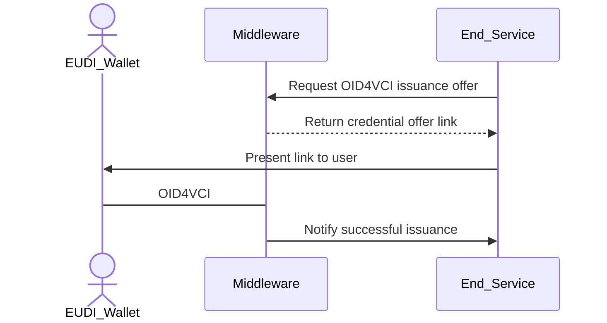

# Configuring Credential Issuance Flows

Issuance flow files define how a credential should be generated, signed, and
formatted. EUDIPLO uses a tenant-based architecture where each tenant has
isolated configuration.

The issuance system uses a **two-layer configuration approach**:

1. **Credential Configurations** - Define the structure, format, and metadata of
   individual credentials
2. **Issuance Configurations** - Define which credentials to issue together and
   authentication requirements

Both configurations have a _many-to-many_ relationship, which means a defined
credential can be used in multiple issuance configurations.

---

## API Endpoints

The system uses two separate endpoints for the two-layer configuration:

### Credential Configurations

To manage individual credential configurations, use the
`/issuer-management/credentials` endpoint. This endpoint handles the definition
of credential types, their formats, claims, and display properties.

### Issuance Configurations

To manage issuance flows (which credentials to issue together and authentication
requirements), use the `/issuer-management/issuance` endpoint. This endpoint
handles grouping credentials and defining authorizations or webhooks.

Based on your passed JWT, both endpoints will be scoped to the tenant ID of the
token. The configurations are internally stored in a database.

### Creating Credential Offers

Via the `/issuer-management/offer` endpoint you can start the issuance flow for
a specific issuance configuration. The credential offer process works as
follows:

1. **Provide an `issuanceId`** - This specifies which issuance configuration to
   use as the base
2. **Optionally override credentials** - Use `credentialConfigurationIds` to
   override which specific credentials are issued
3. **Optionally override claims** - Use the `values` parameter to provide custom
   claims for specific credentials

The issuance configuration defines the default credentials to issue and
authentication requirements, but these can be customized per offer.

---

## Credential Issuance Flow

This flow describes how a backend service starts an issuance flow of an
attestation. EUDIPLO creates the OID4VCI request and handles the protocol flow
with the wallet.

---

## Documentation Structure

This issuance documentation is organized into the following sections:

- **[Credential Configuration](credential-configuration.md)** - Learn how to
  define individual credential types, their structure, claims, and display
  properties
- **[Advanced Features](advanced-features.md)** - Explore key binding, status
  management, expiration, and advanced key management
- **[Authentication Flows](authentication.md)** - Configure different
  authentication methods for issuance flows
- **[API Guide](api-guide.md)** - Step-by-step API usage with examples and curl
  commands
- **[Revocation](revocation.md)** - Manage credential revocation and status
  lists

---

## Quick Start

For a quick start, follow these steps:

1. **Create a credential configuration** - Define your credential type using the
   [Credential Configuration](credential-configuration.md) guide
2. **Create an issuance configuration** - Set up authentication and grouping
   using the [API Guide](api-guide.md)
3. **Issue credentials** - Start the issuance flow by creating credential offers

For advanced features like key binding, status management, or expiration, see
the [Advanced Features](advanced-features.md) section.

---

## Passing Claims

There are three options to pass claims for the credential. They are handled in
the following order:

1. **Webhook response** during presentation during issuance (highest priority)
2. **Claims field** in the credential offer request
3. **Static claims** in the credential configuration (lowest priority)

If no claims are provided, the credential will be issued with an empty claims
set. Claims will not be merged with other claims from e.g. the offer or the
static defined ones - the higher priority source completely overrides lower
priority sources.

---

## Display Configuration

TODO: needs to be updated

This display information gets included into the
[credential issuer metadata](https://openid.net/specs/openid-4-verifiable-credential-issuance-1_0.html#name-credential-issuer-metadata:~:text=2%20or%20greater.-,display,-%3A%20OPTIONAL.%20A%20non).

> `<PUBLIC_URL>` will be dynamically replaced at runtime with your public URL
> together with the tenant ID.
