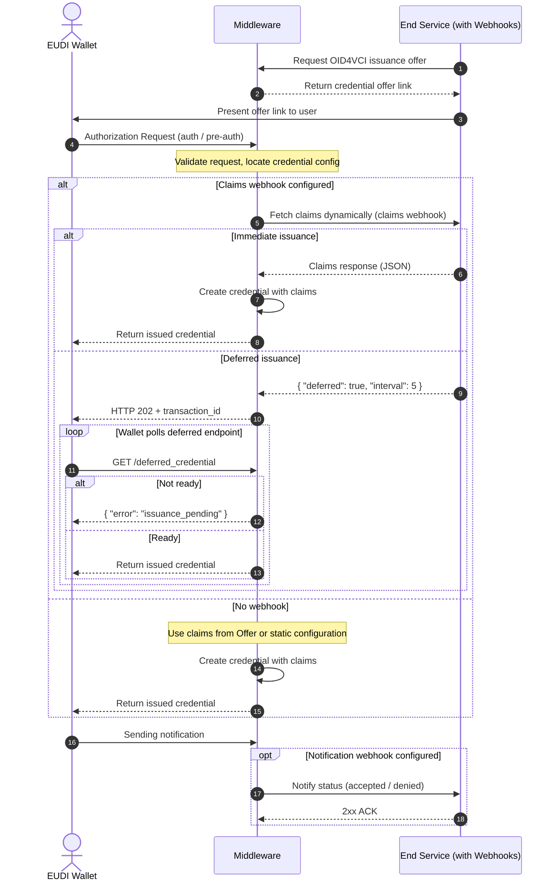
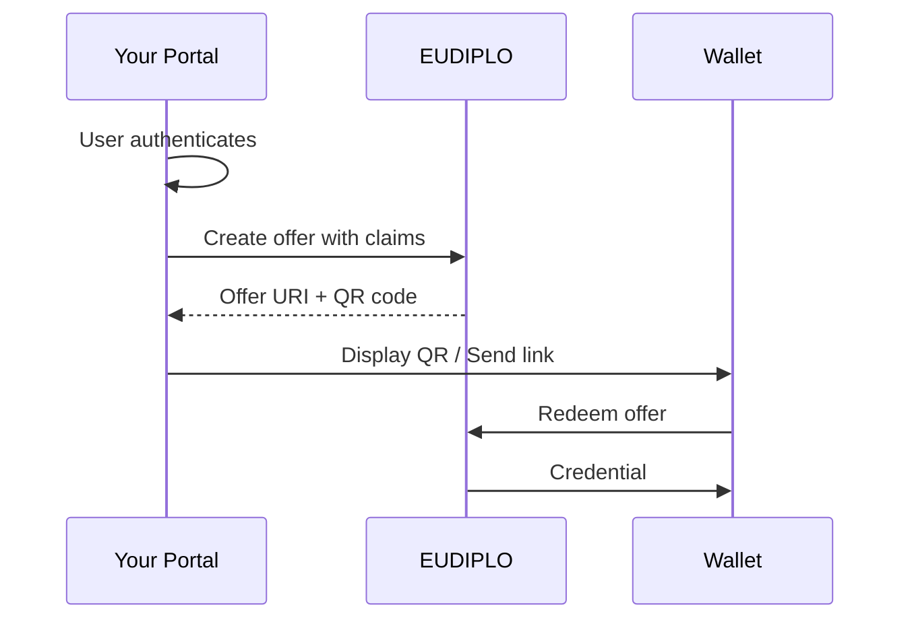
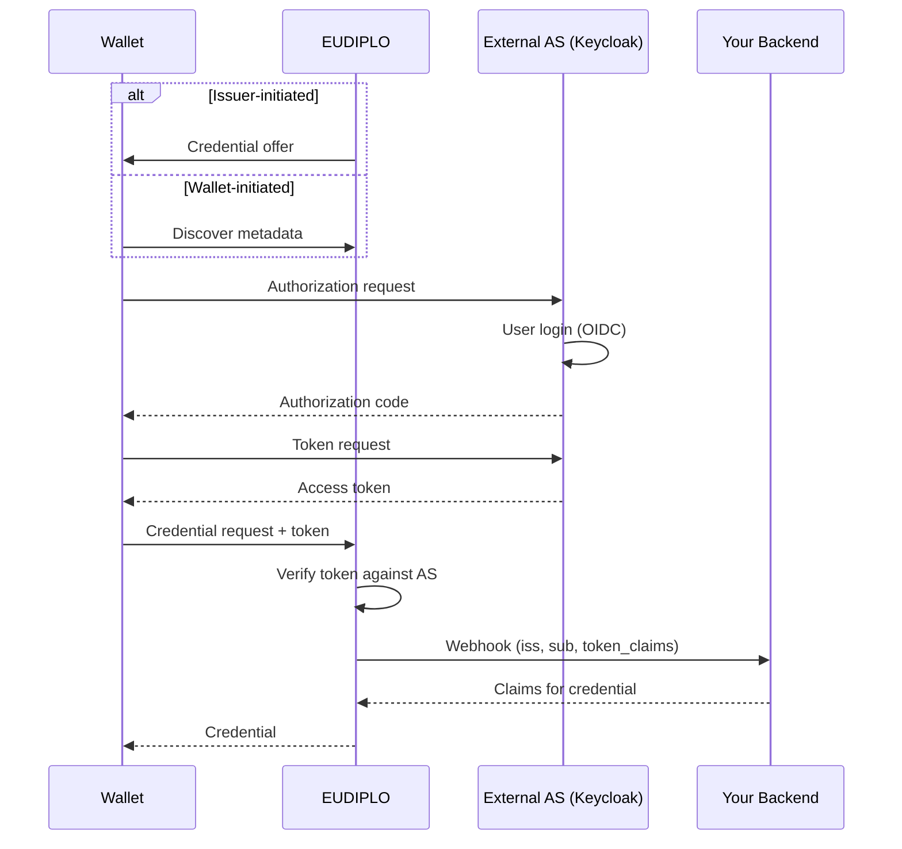
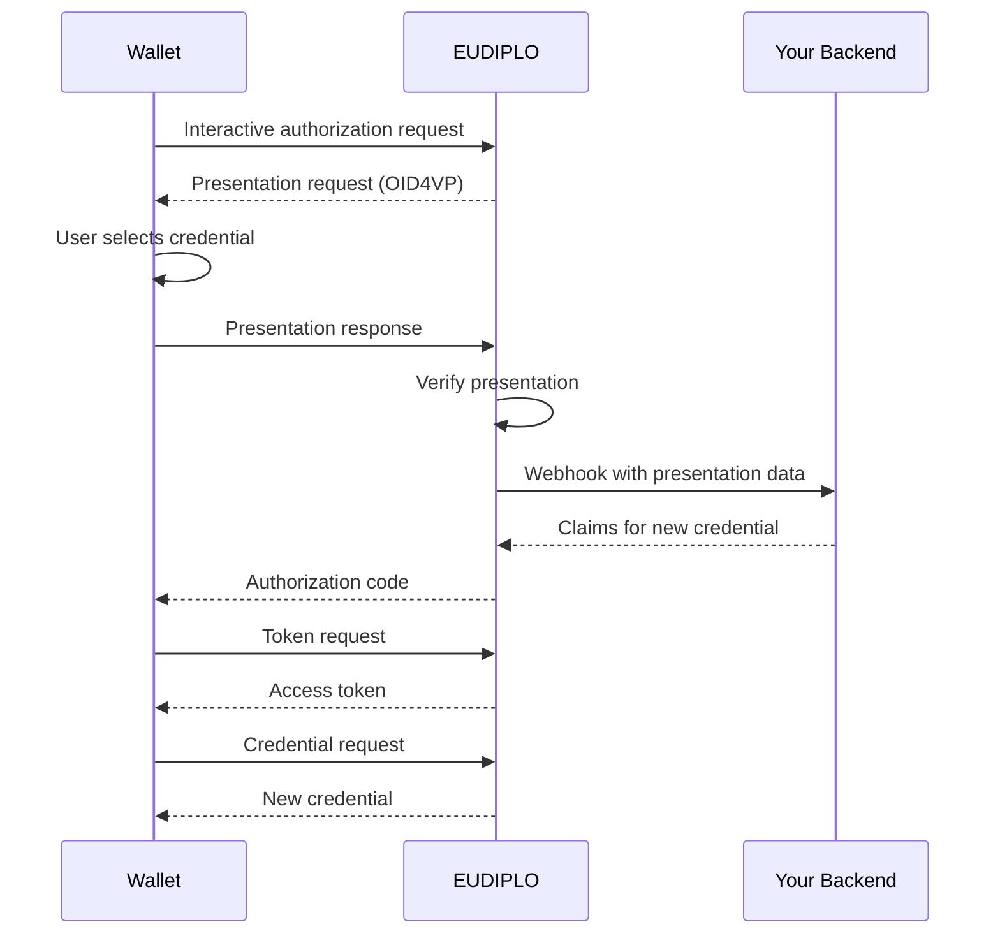
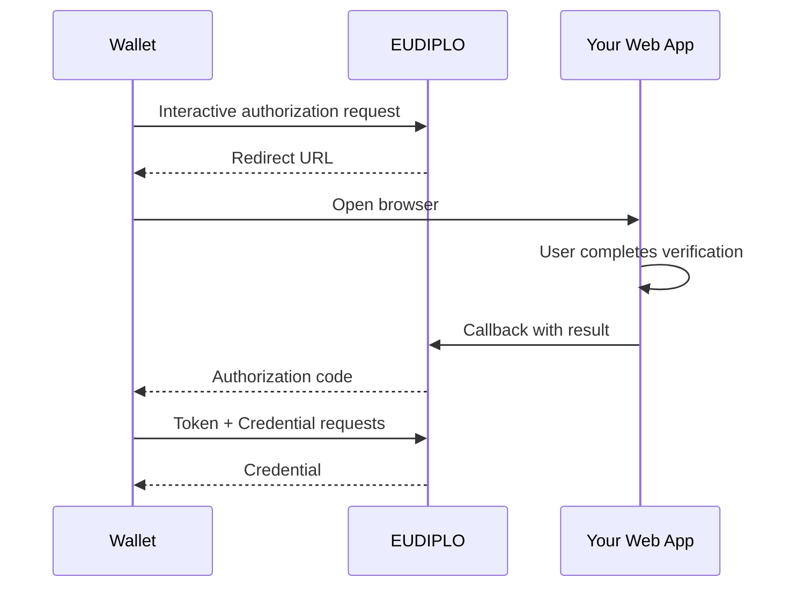
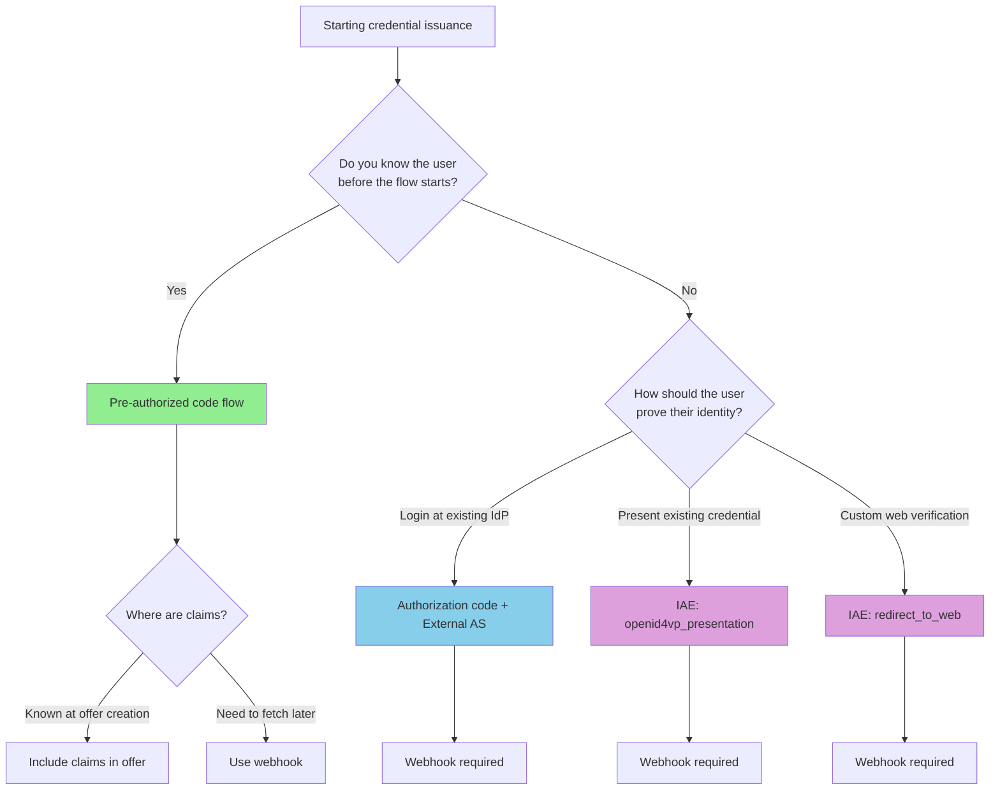

# Configuring Credential Issuance Flows

The issuance system uses a **two-layer configuration approach**:

1. **Credential Configurations** - Define the structure, format, and metadata of
   individual credentials
2. **Issuance Configuration** - Define the issuance configuration that get used to
   group multiple credentials and publish the issuer metadata

---

## API Endpoints

The system uses two separate endpoints for the two-layer configuration:

### Credential Configurations

To manage individual credential configurations, use the
`/issuer/credentials` endpoint. This endpoint handles the definition
of credential types, their formats, claims, and display properties.

### Issuance Configuration

The endpoints to manage issuance configuration can be found in the [API documentation](../../api/openapi.md#issuer) section.

Based on your passed access token, endpoints will be scoped to the tenant ID of the
token. You also need the `issuance:manage` role to access these endpoints.
The configurations are internally stored in a database.

### Creating Credential Offers

Via the [credential offer endpoint](../../api/openapi.md#post-issueroffer) you can create a credential offer that can be presented to the user.
When creating an offer, you can:

1. **Define the flow** - Either go with the pre authorized flow or require user
   authentication via the authorization code flow
2. **Provide credentials** - Use `credentialConfigurationIds` to specify which
   credentials to issue from the issuance configuration
3. **Optionally override claims** - Use the `values` parameter to provide custom
   claims for specific credentials
4. **Optionally pass claim webhooks** - Use the `claimsWebhook` parameter to
   dynamically fetch claims during the issuance flow
5. **Optionally pass notification webhooks** - Use the `notifyWebhook` parameter to
   get notified about issuance status changes

---

## Credential Issuance Flow

This flow describes how a backend service starts an issuance flow of an
attestation. EUDIPLO creates the OID4VCI request and handles the protocol flow
with the wallet. It also shows the interactions with [webhooks](../../architecture/webhooks.md) when they are configured.



The response with the credential offer link will also provide the session ID. It is included in the requests from the optional webhooks to identify the specific issuance flow. You can also use the id to query the issuance status at the API.

---

## Supported Issuance Flows

EUDIPLO supports three authentication patterns for OID4VCI credential issuance. Each pattern serves different use cases depending on how users are identified and authenticated.

### Quick Reference

| Authentication Pattern               | User is Known | User Authentication                              | Initiator        | Claims Source      |
| ------------------------------------ | ------------- | ------------------------------------------------ | ---------------- | ------------------ |
| **Pre-authorized code**              | Yes           | Already authenticated (before offer)             | Issuer only      | Offer or Webhook   |
| **Authorization code + External AS** | No            | OIDC login at external IdP                       | Issuer or Wallet | Webhook (required) |
| **Interactive Authorization (IAE)**  | No            | Credential presentation (OID4VP) or web redirect | Issuer or Wallet | Webhook (required) |

### Understanding the Three Dimensions

#### 1. Authentication Pattern (How is the user identified?)

- **Pre-authorized code**: User was already authenticated _before_ the OID4VCI flow starts. You know who they are and can include their claims in the offer.
- **Authorization code + External AS**: User authenticates during the flow at an external Identity Provider (Keycloak, Azure AD, Okta) via OIDC.
- **Interactive Authorization (IAE)**: User proves their identity by presenting an existing credential (OID4VP) or completing a web-based flow.

#### 2. Initiator (Who starts the flow?)

- **Issuer-initiated**: The issuer creates an offer URI and presents it to the user (QR code, email link, push notification). Used when you want to proactively issue credentials.
- **Wallet-initiated**: The wallet discovers available credentials via issuer metadata and initiates the request. Used for self-service scenarios where users browse available credentials.

!!! info "Pre-authorized code is issuer-initiated only"
Since the user must be known before creating the offer, pre-authorized code flows are always issuer-initiated. The other patterns support both.

#### 3. Claims Source (Where do credential claims come from?)

- **In the offer**: Claims are embedded in the credential offer when it's created. Only possible when the user is known upfront (pre-authorized code flow).
- **Via webhook**: EUDIPLO calls your backend to fetch claims based on user identity information. Required when user identity is established during the flow.

---

### Flow Details

#### Pre-authorized Code Flow

**Use when:** You already know who the user is before starting the issuance flow.



**Examples:**

- Employee onboarding portal creates badge credential after HR verification
- University issues diploma after graduation is confirmed
- Government portal issues ID after identity verification process

**Configuration:**

```json
{
    "claims": {
        "given_name": "Alice",
        "family_name": "Smith",
        "employee_id": "EMP-12345"
    }
}
```

Or use a webhook if you don't want to embed claims in the offer:

```json
{
    "claimsWebhook": {
        "url": "https://your-service.example.com/claims"
    }
}
```

---

#### Authorization Code Flow with External AS

**Use when:** You have an existing Identity Provider and want users to authenticate via OIDC.



**Examples:**

- Enterprise deployment where employees authenticate via corporate Keycloak
- Multi-tenant SaaS where each tenant uses their own IdP
- Wallet-initiated flows where users browse available credentials

**Configuration:**

- Configure external authorization servers in issuance config:

```json
{
    "authServers": ["https://keycloak.example.com/realms/myrealm"],
    "dPopRequired": true
}
```

- Configure claims webhook on the credential configuration:

```json
{
    "claimsWebhook": {
        "url": "https://your-service.example.com/claims",
        "auth": {
            "type": "apiKey",
            "config": {
                "headerName": "X-API-Key",
                "value": "your-secret-key"
            }
        }
    }
}
```

Your webhook receives:

```json
{
    "session": "a6318799-dff4-4b60-9d1d-58703611bd23",
    "credential_configuration_id": "EmployeeBadge",
    "identity": {
        "iss": "https://keycloak.example.com/realms/myrealm",
        "sub": "user-uuid-from-keycloak",
        "token_claims": {
            "email": "user@example.com",
            "preferred_username": "jdoe"
        }
    }
}
```

See [Webhooks](../../architecture/webhooks.md#claims-webhook-request-format) for full payload details.

---

#### Interactive Authorization Endpoint (IAE)

**Use when:** You want users to prove their identity by presenting an existing credential or completing a web-based verification.

The IAE supports two interaction types:

| Interaction Type         | Description                                       | Use Case                                          |
| ------------------------ | ------------------------------------------------- | ------------------------------------------------- |
| `openid4vp_presentation` | User presents an existing credential via OID4VP   | Issue derived credentials based on existing ones  |
| `redirect_to_web`        | User is redirected to a web page for verification | Custom verification flows, OIDC login, form entry |

##### OID4VP Presentation Flow



**Examples:**

- Issue a loyalty card credential based on a presented membership credential
- Issue a student discount credential based on a university ID credential
- Age verification: issue age attestation based on presented ID

**Configuration:**

Configure IAE action on the credential configuration:

```json
{
    "iaeAction": {
        "type": "openid4vp_presentation",
        "presentationDefinition": {
            "id": "verify-membership",
            "input_descriptors": [
                {
                    "id": "membership-credential",
                    "constraints": {
                        "fields": [
                            {
                                "path": ["$.vct"],
                                "filter": {
                                    "type": "string",
                                    "const": "MembershipCredential"
                                }
                            }
                        ]
                    }
                }
            ]
        }
    },
    "claimsWebhook": {
        "url": "https://your-service.example.com/iae-claims"
    }
}
```

##### Redirect to Web Flow



**Examples:**

- Custom OIDC login flow with additional verification steps
- Payment verification before issuing premium credentials
- Terms acceptance or consent collection

**Configuration:**

```json
{
    "iaeAction": {
        "type": "redirect_to_web",
        "redirectUrl": "https://your-app.example.com/verify",
        "callbackUrl": "https://issuer.example.com/{tenantId}/authorize/interactive/callback"
    }
}
```

---

### Decision Flowchart



---

## Deferred Credential Issuance

EUDIPLO supports **deferred credential issuance** for scenarios where credentials cannot be issued immediately. This is useful when:

- **Background verification** is required (e.g., KYC, identity proofing)
- **Approval workflows** must be completed before issuance
- **External data sources** need time to respond
- **Asynchronous processing** is required

When your claims webhook returns `{ "deferred": true }`, EUDIPLO returns a `transaction_id` to the wallet. The wallet then polls the `/deferred_credential` endpoint until the credential is ready.

For detailed information on implementing deferred issuance, see the [Deferred Credential Issuance](../../architecture/webhooks.md#deferred-credential-issuance) section in the Webhooks documentation.

---

## Documentation Structure

This issuance documentation is organized into the following sections:

- **[Credential Configuration](credential-configuration.md)** - Learn how to
  define individual credential types, their structure, claims, and display
  properties
- **[Issuance Configuration](issuance-configuration.md)** - Understand how to
  create issuance configurations that group multiple credentials and define
  issuance parameters such as authorization and webhooks

---

## Quick Start

For a quick start, follow these steps:

1. **Create a credential configuration** - Define your credential type using the
   [Credential Configuration](credential-configuration.md) guide
2. **Create an issuance configuration** - Define the issuance configuration using
   the [Issuance Configuration](issuance-configuration.md) guide
3. **Issue credentials** - Start the issuance flow by creating credential offers

---

## Passing Claims

EUDIPLO provides multiple methods to pass claims (data) for credentials during issuance, with a clear priority system that determines which claims are used.

### Priority Order

Claims are resolved in the following priority order (highest to lowest):

1. **Offer-level webhook** - Webhook specified in the credential offer
2. **Offer-level static claims** - Claims specified in the credential offer
3. **Configuration-level webhook** - Webhook defined in the credential configuration
4. **Configuration-level static claims** - Claims defined in the credential configuration

!!! warning "Claims are not merged"

    Higher priority sources completely override lower priority sources - claims are not merged. If an offer-level webhook is provided, all configuration-level claims will be entirely ignored.

For a detailed explanation of the claims priority system and how to configure each method, see the [Fetching Claims](credential-configuration.md#fetching-claims) section in the Credential Configuration documentation.

### When to Use Each Method

- **Configuration-level static claims** - Default values for all credentials of this type, fixed metadata (e.g., issuing country, authority)
- **Configuration-level webhook** - Dynamic claims based on authentication context, personalized credentials requiring real-time data
- **Offer-level static claims** - Claims known at offer creation time, overriding specific values for individual issuances
- **Offer-level webhook** - Custom data source per offer, testing different webhook endpoints
