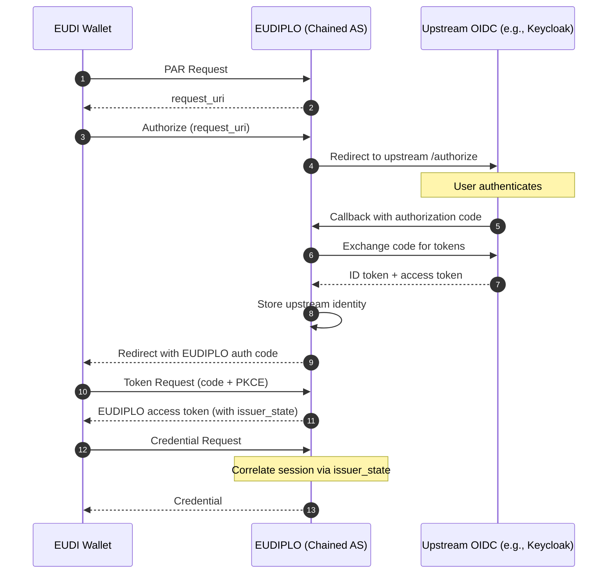

# Issuance Configuration

Issuance configurations define the parameters and settings for the issuance of credentials. This includes details such as the supported credential types, issuance policies, and any specific requirements for the issuance process.

---

## Basic Structure

**Example Issuance Configuration:**

```json
--8<-- "assets/config/root/issuance/issuance.json"
```

!!! Info

    The auto generated schema reference can be found in the [API Documentation](../../../api/openapi/#issuancedto)

## Configuration Fields

- `authServers` (array of strings, optional): Authentication server URL for the issuance process.
- `notifyWebhook` (object, optional): Webhook to send the result of the notification response. See [Webhooks](../../architecture/webhooks.md#notification-webhook).
- `batchSize` (number, optional): Value to determine the amount of credentials that are issued in a batch. Default is 1.
- `dPopRequired` (boolean, optional): Indicates whether DPoP is required for the issuance process. Default value is true.
- `walletAttestationRequired` (boolean, optional): Indicates whether wallet attestation is required for the token endpoint. Default value is false. See [Wallet Attestation](#wallet-attestation) below.
- `walletProviderTrustLists` (array of strings, optional): URLs of trust lists containing trusted wallet providers. Required when `walletAttestationRequired` is true.
- `display` (array of objects, required): The display information from the [OID4VCI spec](https://openid.net/specs/openid-4-verifiable-credential-issuance-1_0.html#name-credential-issuer-metadata:~:text=2%20or%20greater.-,display,-%3A%20OPTIONAL.%20A%20non). To host images or logos, you can use the [storage](../../architecture/storage.md) system provided by EUDIPLO.

---

## Wallet Attestation

Wallet attestation allows issuers to verify that credential requests come from trusted wallet applications. When enabled, wallets must provide OAuth Client Attestation headers at the token endpoint, as specified in [RFC 9449](https://datatracker.ietf.org/doc/html/rfc9449) and the [OID4VCI specification](https://openid.net/specs/openid-4-verifiable-credential-issuance-1_0.html).

### How It Works

1. **Wallet Provider Signs Attestation**: The wallet provider (e.g., the wallet app vendor) signs a JWT attesting to the wallet instance's identity. This JWT includes an X.509 certificate chain in the `x5c` header.

2. **Wallet Sends Attestation**: When requesting an access token, the wallet includes two headers:
    - `OAuth-Client-Attestation`: The wallet attestation JWT signed by the wallet provider
    - `OAuth-Client-Attestation-PoP`: A proof-of-possession JWT signed by the wallet instance

3. **Issuer Validates**: EUDIPLO validates the attestation by:
    - Verifying the JWT signature using the X.509 certificate from the `x5c` header
    - Verifying the proof-of-possession (PoP) JWT
    - Checking that the wallet provider's certificate is trusted according to the configured trust lists

### Configuration

To enable wallet attestation, set `walletAttestationRequired` to `true` and provide at least one trust list URL:

```json
{
    "walletAttestationRequired": true,
    "walletProviderTrustLists": ["https://trust-list.example.eu/wallet-providers"]
}
```

### Trust Lists

Trust lists must be in the LoTE (List of Trusted Entities) format as defined by [ETSI TS 119 612](https://www.etsi.org/deliver/etsi_ts/119600_119699/119612/). The trust list should contain entries with the service type `http://uri.etsi.org/19602/SvcType/WalletProvider`.

Each trusted entity in the list includes X.509 certificates that identify authorized wallet providers. When a wallet presents an attestation, EUDIPLO verifies that the signing certificate chains to one of these trusted certificates.

### Status Claim

The wallet attestation JWT may optionally contain a `status` claim that provides a URI for checking the current validity or revocation status of the attestation. According to the [OAuth Attestation-Based Client Authentication](https://datatracker.ietf.org/doc/html/draft-ietf-oauth-attestation-based-client-auth) specification, this claim is **optional**.

!!! note "Current Behavior"

    EUDIPLO currently does **not** check the `status` claim in wallet attestations. Attestations are validated based on:

    - JWT signature verification
    - Proof-of-possession verification
    - X.509 certificate chain validation against configured trust lists

    If your use case requires status checking (e.g., for revoked wallet instances), this would need to be implemented as an additional validation step.

!!! warning "Important"

    If `walletAttestationRequired` is set to `true` but no trust lists are configured, **all wallet requests will be rejected**. Always configure at least one trust list when enabling wallet attestation.

!!! info "EUDI Wallet Ecosystem"

    In the EUDI Wallet ecosystem, trust lists are typically published by EU member states or the European Commission, containing the certificates of approved wallet providers.

---

## Chained Authorization Server

Chained AS mode allows EUDIPLO to act as an OAuth Authorization Server facade, delegating user authentication to an upstream OIDC provider (e.g., Keycloak) while issuing its own access tokens containing `issuer_state` for session correlation.

This approach enables credential issuance flows that require user authentication without modifying your existing OIDC provider.

### When to Use Chained AS

| Use Case                                     | Recommendation              |
| -------------------------------------------- | --------------------------- |
| Need session correlation with `issuer_state` | ✅ Use Chained AS           |
| Cannot modify upstream OIDC provider         | ✅ Use Chained AS           |
| Want EUDIPLO to control token claims         | ✅ Use Chained AS           |
| Upstream already includes `issuer_state`     | ❌ Use External AS directly |
| Pre-authorized code flow only                | ❌ Not needed               |

### How It Works



### Configuration

Add the `chainedAs` object to your issuance configuration:

```json
{
  "display": [...],
  "chainedAs": {
    "enabled": true,
    "upstream": {
      "issuer": "https://keycloak.example.com/realms/eudiplo",
      "clientId": "eudiplo-chained-as",
      "clientSecret": "your-client-secret",
      "scopes": ["openid", "profile", "email"]
    },
    "token": {
      "lifetimeSeconds": 3600,
      "signingKeyId": "default"
    },
    "requireDPoP": false
  }
}
```

### Configuration Fields

| Field                             | Type     | Required | Description                                                     |
| --------------------------------- | -------- | -------- | --------------------------------------------------------------- |
| `chainedAs.enabled`               | boolean  | Yes      | Enable Chained AS mode                                          |
| `chainedAs.upstream.issuer`       | string   | Yes      | Upstream OIDC provider URL (must support discovery)             |
| `chainedAs.upstream.clientId`     | string   | Yes      | Client ID registered at upstream provider                       |
| `chainedAs.upstream.clientSecret` | string   | Yes      | Client secret for upstream provider                             |
| `chainedAs.upstream.scopes`       | string[] | No       | Scopes to request (default: `["openid", "profile", "email"]`)   |
| `chainedAs.token.lifetimeSeconds` | number   | No       | Access token lifetime in seconds (default: 3600)                |
| `chainedAs.token.signingKeyId`    | string   | No       | Key ID for signing tokens (uses default signing key if omitted) |
| `chainedAs.requireDPoP`           | boolean  | No       | Require DPoP proof from wallets (default: false)                |

### Upstream OIDC Provider Setup

Configure your upstream OIDC provider (e.g., Keycloak) with:

1. **Client Type**: Confidential client with client credentials
2. **Redirect URI**: `https://your-eudiplo-url/{tenant}/chained-as/callback`
3. **Scopes**: Enable `openid`, `profile`, `email` (or as needed)

### Endpoints

When Chained AS is enabled, the following endpoints become available:

| Endpoint                                                      | Method | Description                  |
| ------------------------------------------------------------- | ------ | ---------------------------- |
| `/{tenant}/chained-as/par`                                    | POST   | Pushed Authorization Request |
| `/{tenant}/chained-as/authorize`                              | GET    | Authorization endpoint       |
| `/{tenant}/chained-as/callback`                               | GET    | Upstream callback handler    |
| `/{tenant}/chained-as/token`                                  | POST   | Token endpoint               |
| `/{tenant}/chained-as/.well-known/oauth-authorization-server` | GET    | AS metadata                  |
| `/{tenant}/chained-as/.well-known/jwks.json`                  | GET    | JSON Web Key Set             |

### Token Claims

Access tokens issued by the Chained AS include:

```json
{
    "iss": "https://eudiplo.example.com/{tenant}/chained-as",
    "sub": "{client_id}",
    "aud": "https://eudiplo.example.com/{tenant}",
    "issuer_state": "{session_id}",
    "client_id": "{wallet_client_id}",
    "upstream_sub": "{upstream_user_subject}",
    "upstream_iss": "{upstream_issuer}",
    "cnf": { "jkt": "{dpop_thumbprint}" }
}
```

!!! tip "Session Correlation"

    The `issuer_state` claim links the access token to the credential offer session, enabling EUDIPLO to correlate the credential request with the original offer without requiring the upstream OIDC provider to include custom claims.

!!! warning "Client Secret Security"

    Store the upstream client secret securely. Consider using environment variables or a secrets manager rather than storing it directly in configuration files.
