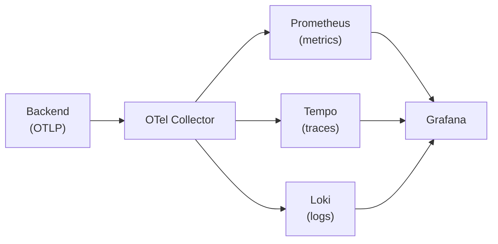

# Monitoring

This guide shows how to set up observability for EUDIPLO using OpenTelemetry,
Prometheus, Tempo, Loki, and Grafana.

## Architecture

EUDIPLO exports all telemetry signals (metrics, traces, logs) via
**OpenTelemetry Protocol (OTLP)** to an OpenTelemetry Collector, which routes
them to the appropriate backends:



Grafana provides unified visualization with cross-signal correlation — jump from
a trace to related logs, or from metrics to traces.

## Quick Start

The monitoring stack in `monitor/` includes:

| Service                     | URL                       | Purpose                  |
| --------------------------- | ------------------------- | ------------------------ |
| **OpenTelemetry Collector** | `localhost:4317` / `4318` | OTLP receiver            |
| **Prometheus**              | <http://localhost:9090>   | Metrics storage          |
| **Tempo**                   | <http://localhost:3200>   | Distributed tracing      |
| **Loki**                    | <http://localhost:3100>   | Log aggregation          |
| **Grafana**                 | <http://localhost:3001>   | Dashboards & exploration |

### Start Monitoring Stack

```bash
cd monitor/
docker-compose up -d
```

## Local Development Setup

When running EUDIPLO locally (outside Docker) with the monitoring stack:

### 1. Start the Monitoring Stack

```bash
cd monitor/
docker-compose up -d
```

### 2. Start EUDIPLO Backend

```bash
# From project root
pnpm --filter @eudiplo/backend dev
```

The backend exports telemetry to `http://localhost:4318` by default (the OTel
Collector's HTTP endpoint).

### 3. Verify Telemetry

- **Metrics**: Open <http://localhost:9090/targets> — the `otel-collector`
  target should be UP
- **Traces**: Open <http://localhost:3001>, go to Explore → Tempo, and search
  for recent traces
- **Logs**: In Grafana, go to Explore → Loki and query `{service_name="eudiplo-backend"}`

## Docker Container Setup

When running EUDIPLO as a Docker container alongside the monitoring stack:

### 1. Configure OTLP Endpoint

Set the OTLP endpoint to the collector's container name:

```bash
OTEL_EXPORTER_OTLP_ENDPOINT=http://otel-collector:4318
```

### 2. Ensure Network Connectivity

Add EUDIPLO to the same Docker network as the monitoring stack, or use
`host.docker.internal` if running separately.

Example in your application's `docker-compose.yml`:

```yaml
services:
    eudiplo:
        image: eudiplo/eudiplo:latest
        ports:
            - '3000:3000'
        environment:
            - OTEL_EXPORTER_OTLP_ENDPOINT=http://otel-collector:4318
        networks:
            - monitor_default # Join the monitor stack's network

networks:
    monitor_default:
        external: true
```

### 3. Start Full Stack

```bash
# Start monitoring
cd monitor/ && docker-compose up -d

# Start EUDIPLO (from project root or deployment folder)
docker-compose up -d
```

## Environment Variables

| Variable                       | Description                               | Default                 |
| ------------------------------ | ----------------------------------------- | ----------------------- |
| `OTEL_EXPORTER_OTLP_ENDPOINT`  | OTLP collector endpoint                   | `http://localhost:4318` |
| `OTEL_SERVICE_NAME`            | Service name in telemetry                 | `eudiplo-backend`       |
| `OTEL_SDK_DISABLED`            | Disable OTel SDK entirely                 | `false`                 |
| `GRAFANA_URL`                  | Grafana base URL for dashboard deep links | _(not set)_             |
| `GRAFANA_DATASOURCE_TEMPO_UID` | UID of the Tempo datasource in Grafana    | `tempo`                 |
| `GRAFANA_DATASOURCE_LOKI_UID`  | UID of the Loki datasource in Grafana     | `loki`                  |

Set `OTEL_SDK_DISABLED=true` for local development without a collector running.

## Available Metrics

### Auto-Instrumented (via OpenTelemetry)

- `http_server_request_duration_seconds` — HTTP request duration histogram
- `http_server_active_requests` — Currently active HTTP requests
- Host metrics (CPU, memory, event loop) via `nestjs-otel`

### Business Metrics

- `sessions` — Active sessions by status and tenant
- `tenant_total` — Total number of tenants

## Access Dashboards

### Grafana

<http://localhost:3001>

- **Username**: `admin`
- **Password**: `admin`

Pre-configured datasources:

- **Prometheus** — for metrics
- **Tempo** — for traces
- **Loki** — for logs

Cross-signal correlation is enabled:

- **Traces → Logs**: Jump from a span to correlated log lines in Loki
- **Logs → Traces**: Extract `trace_id` from Pino log fields and link to Tempo

### Prometheus

<http://localhost:9090>

- View metrics and run PromQL queries
- Check targets status at <http://localhost:9090/targets>

## Alerting Rules

Pre-configured alerts in `monitor/prometheus/rules/eudiplo.yml`:

| Alert                | Condition                            |
| -------------------- | ------------------------------------ |
| **HighErrorRate**    | HTTP 5xx rate exceeds 5% of requests |
| **ServiceDown**      | OTel Collector target is down        |
| **HighResponseTime** | P95 response time exceeds 2 seconds  |

### Add Custom Alerts

1. Edit `monitor/prometheus/rules/eudiplo.yml`
2. Restart Prometheus: `docker-compose restart prometheus`

## Configuration Files

All configuration files are in the `monitor/` directory:

| File                                       | Purpose                    |
| ------------------------------------------ | -------------------------- |
| `otel-collector/otel-collector-config.yml` | Collector pipelines        |
| `prometheus/prometheus.yml`                | Prometheus scrape config   |
| `prometheus/rules/eudiplo.yml`             | Alerting rules             |
| `tempo/tempo.yml`                          | Trace storage config       |
| `loki/loki.yml`                            | Log aggregation config     |
| `grafana/datasources/`                     | Grafana datasource configs |
| `grafana/dashboards/`                      | Pre-built dashboards       |

## Troubleshooting

### No Metrics in Prometheus

1. Check the collector is receiving data: `curl http://localhost:8889/metrics`
2. Verify the backend's OTLP endpoint is correct
3. Check collector logs: `docker-compose logs otel-collector`

### No Traces in Tempo

1. Verify traces pipeline in collector config
2. Check Tempo is healthy: `curl http://localhost:3200/ready`
3. Ensure the backend is generating traces (make some API requests)

### No Logs in Loki

1. Check logs pipeline in collector config
2. Verify Loki is receiving data: `curl http://localhost:3100/ready`
3. Query with broader label selector: `{job=~".+"}`

### Disable Telemetry Locally

Set `OTEL_SDK_DISABLED=true` in your environment to disable all OpenTelemetry
instrumentation when running without a collector.

## Grafana Deep Links from the Dashboard

The EUDIPLO client UI can link directly to Grafana for viewing logs and traces
related to specific sessions. This improves the debugging experience by
providing one-click navigation from the dashboard to Grafana Explore.

### Setup

Set the `GRAFANA_URL` environment variable on the backend to the base URL of
your Grafana instance:

```bash
# Local development (default monitor stack)
GRAFANA_URL=http://localhost:3001

# Production example
GRAFANA_URL=https://grafana.example.com
```

If your Grafana datasource UIDs differ from the defaults (`tempo` for Tempo,
`loki` for Loki), also set:

```bash
GRAFANA_DATASOURCE_TEMPO_UID=my-tempo-uid
GRAFANA_DATASOURCE_LOKI_UID=my-loki-uid
```

### Where Deep Links Appear

When `GRAFANA_URL` is configured, the following links are available:

| Location                     | Link                   | Opens                                          |
| ---------------------------- | ---------------------- | ---------------------------------------------- |
| **Dashboard** (main page)    | _Open Grafana_         | Grafana home                                   |
| **Dashboard** (Resources)    | _Grafana Dashboard_    | Grafana home                                   |
| **Session Details** (header) | _Logs_                 | Grafana Explore → Loki filtered by session ID  |
| **Session Details** (header) | _Traces_               | Grafana Explore → Tempo filtered by session ID |
| **Session Logs** tab         | _View in Grafana_      | Grafana Explore → Loki filtered by session ID  |
| **Session Log entry**        | Trace icon (per entry) | Grafana Explore → Tempo for that trace ID      |

### Graceful Degradation

When `GRAFANA_URL` is **not set**, all Grafana-related links are hidden
automatically. No configuration is required to disable the feature — it is
opt-in by default.

### Datasource UID Discovery

To find your Grafana datasource UIDs:

1. Open Grafana → **Connections → Data sources**
2. Click on Tempo or Loki
3. The UID is in the URL: `http://grafana:3000/connections/datasources/edit/<uid>`

The default provisioned UIDs for the included monitor stack are `tempo` and
`loki` (set in `monitor/grafana/provisioning/datasources/`).

## Clean Up

```bash
# Stop monitoring stack
cd monitor/
docker-compose down

# Remove volumes (deletes all data)
docker-compose down -v
```
