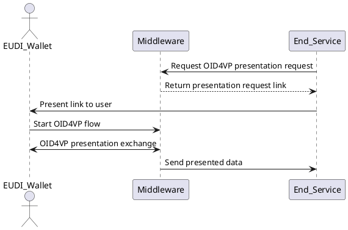
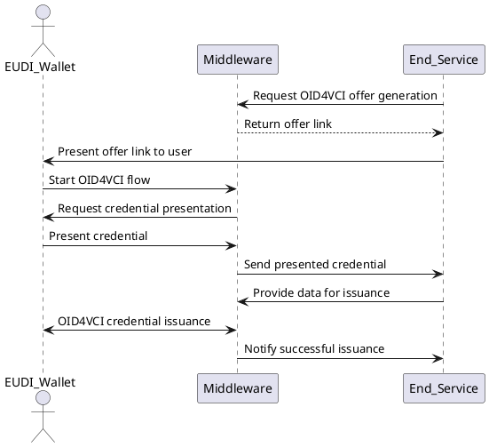

# Configuring Presentation Flows

Presentation flow files define what credentials should be requested from the
user and which claims must be disclosed. EUDIPLO uses a tenant-based
architecture where each tenant has isolated configuration.

---

## API Endpoints

To manage the configs for presentation, you need to interact with the
`/presentation-management` endpoint. Based on your passed JWT, the endpoint will
be scoped to the tenant ID of the token. The configurations are internally
stored in a database.

Via this endpoint you are also able to start the presentation flow for a
specific flow configuration.

---

## Credential Presentation Flow

This flow describes how a backend service requests a credential presentation
(e.g., to authorize a user or verify an attribute). EUDIPLO creates the OID4VP
request and handles the protocol flow with the wallet.



---

## Credential Presentation During Issuance

This flow describes an advanced scenario where the end-user is required to
**present a credential** during the issuance of another credential. This is
useful when a prior attribute (e.g. student ID, PID) is needed to qualify for
the new credential.



## Example Presentation Request

```json
{
    "dcql_query": {
        "credentials": [
            {
                "id": "pid",
                "format": "dc+sd-jwt",
                "meta": {
                    "vct_values": ["<PUBLIC_URL>/credentials/vct/pid"]
                },
                "claims": [
                    {
                        "path": ["address", "locality"]
                    }
                ]
            }
        ]
    },
    "registrationCert": {
        "body": {
            "privacy_policy": "https://example.com/privacy-policy",
            "purpose": [
                {
                    "locale": "en-US",
                    "name": "To register a new user"
                }
            ],
            "contact": {
                "website": "https://example.com/contact",
                "e-mail": "privacy@example.com",
                "phone": "+1234567890"
            },
            "credentials": [
                {
                    "format": "dc+sd-jwt",
                    "meta": {
                        "vct_values": ["<PUBLIC_URL>/credentials/vct/pid"]
                    },
                    "claims": [
                        {
                            "path": ["address", "locality"]
                        }
                    ]
                }
            ]
        },
        "id": "ea140773-5f7f-4e39-a21c-d2a5f912deb2"
    },
    "webhook": { "url": "http://localhost:8787/consume" }
}
```

**Field Breakdown**

- `dcql_query`: REQUIRED:
  [Digital Credentials Query Language](https://openid.net/specs/openid-4-verifiable-presentations-1_0.html#name-digital-credentials-query-l)
  Defines the credentials and claims to be requested.
- `registrationCert`: REQUIRED: Contains the legal purpose and contact
  information for processing personal data aligned with the
  [Blueprint](https://bmi.usercontent.opencode.de/eudi-wallet/eidas-2.0-architekturkonzept/flows/Wallet-Relying-Party-Authentication/)
- `webhook`: OPTIONAL: The URL where the verified presentation will be sent
  after the user completes the flow, for more information, see
  [Webhook Integration](./webhooks.md). If not provided, the data can be fetched
  via the session ID returned in the initial request.

> `<PUBLIC_URL>` will be dynamically replaced at runtime with your public URL
> together with with the tenant ID.

---

## Creating a Presentation Request

To start the presentation flow, you need to create a presentation request. This
is done by calling the `/presentation-management/request` endpoint. Via the
`response_type` parameter, you can specify how the response should be formatted:

- `uri`: Returns a URI that the user can open in their wallet to start the
  presentation flow.
- `qrcode`: Returns a QR code that the user can scan with their wallet to start
  the presentation flow.

While the `qrcode` is good for easy testing with the Swagger UI, the `uri` is
recommended to also receive the session ID in the response that is needed to
fetch information about the session later on.

```bash
curl -X 'POST' \
  'http://localhost:3000/presentation-management/offer' \
  -H 'accept: application/json' \
  -H 'Authorization: Bearer eyJhb...npoNk' \
  -H 'Content-Type: application/json' \
  -d '{
  "response_type": "qrcode",
  "requestId": "pid",
}'
```
