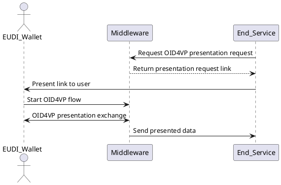
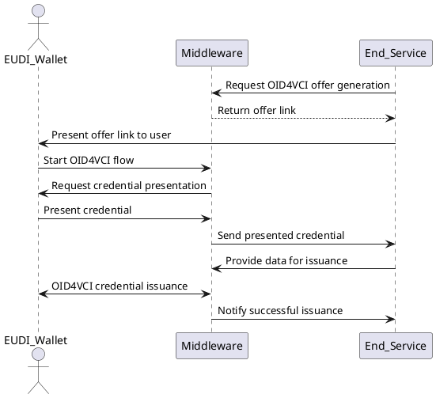

# Configuring Presentation Flows

Presentation flow files define what credentials should be requested from the user and which claims must be disclosed. These files are placed in:

```string
config/presentation/{id}.json
```

Each file corresponds to a specific presentation scenario and uses DCQL to define the query.

---

## 🔍 Credential Presentation Flow

This flow describes how a backend service requests a credential presentation (e.g., to authorize a user or verify an attribute). EUDIPLO creates the OID4VP request and handles the protocol flow with the wallet.



---

## 🔁 Credential Presentation During Issuance

This flow describes an advanced scenario where the end-user is required to **present a credential** during the issuance of another credential. This is useful when a prior attribute (e.g. student ID, PID) is needed to qualify for the new credential.



## ✅ Example Presentation Request

```json
{
  "dcql_query": {
    "credentials": [
      {
        "id": "pid",
        "format": "dc+sd-jwt",
        "meta": {
          "vct_values": [
            "<CREDENTIAL_ISSUER>/credentials/vct/pid"
          ]
        },
        "claims": [
          {
            "path": [
              "address",
              "locality"
            ]
          }
        ]
      }
    ]
  },
  "registrationCert": {
    "body": {
      "privacy_policy": "https://example.com/privacy-policy",
      "purpose": [
        {
          "locale": "en-US",
          "name": "To register a new user"
        }
      ],
      "contact": {
        "website": "https://example.com/contact",
        "e-mail": "privacy@example.com",
        "phone": "+1234567890"
      },
      "credentials": [
        {
          "format": "dc+sd-jwt",
          "meta": {
            "vct_values": [
              "<CREDENTIAL_ISSUER>/credentials/vct/pid"
            ]
          },
          "claims": [
            {
              "path": [
                "address",
                "locality"
              ]
            }
          ]
        }
      ]
    },
    "id": "ea140773-5f7f-4e39-a21c-d2a5f912deb2"
  },
  "webhook": "http://localhost:3001/consume"
}
```

---

## 📌 Field Breakdown

| Field              | Description                                                                 |
|--------------------|-----------------------------------------------------------------------------|
| `dcql_query`       | Describes required credentials and claims                                   |
| `registrationCert` | Declares the legal purpose and contact info for processing personal data    |
| `webhook`          | URL where the verified presentation will be sent                           |

> 🔧 `<CREDENTIAL_ISSUER>` is replaced automatically at runtime based on your configured `PROXY` value.

---

## 🧪 How to Test

1. Place your file in `config/presentations/`
2. Check it is loaded via `GET /presentations`
3. Trigger the presentation request (e.g. `/oid4vp`)
