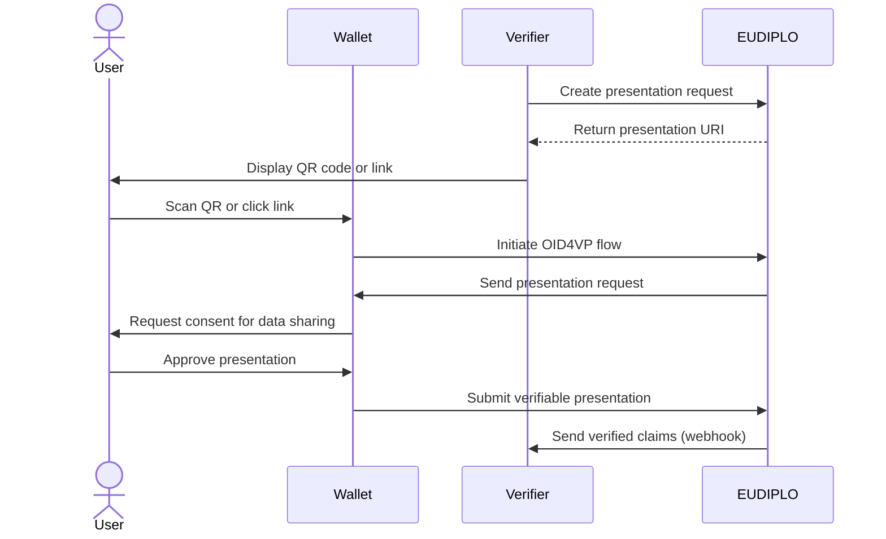
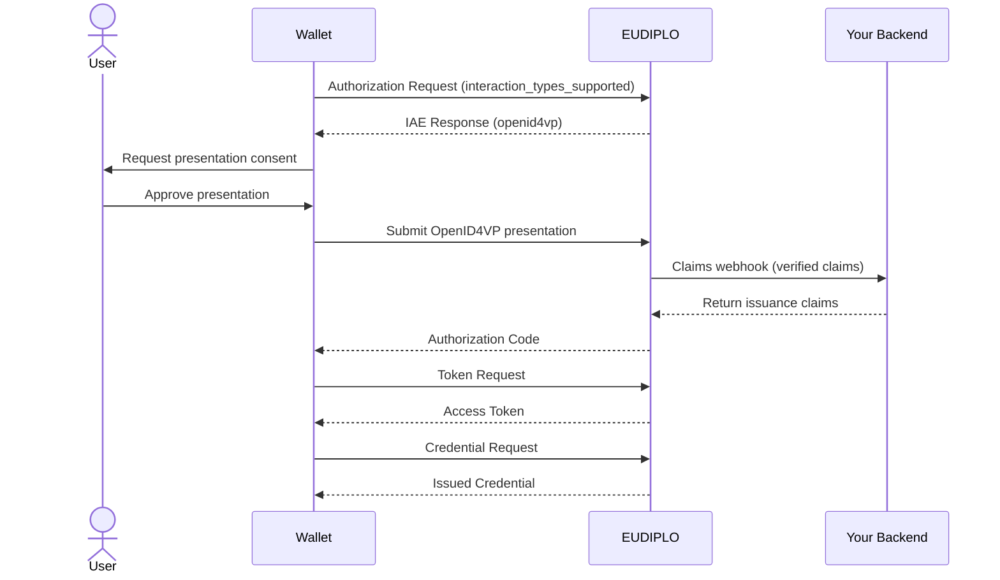

# Credential Presentation

EUDIPLO provides comprehensive credential presentation capabilities using
OpenID4VP (OpenID for Verifiable Presentations). This system allows verifiers to
request specific credentials and claims from users, enabling secure identity
verification and attribute validation.

---

## Overview

Credential presentation enables verifiers to:

- **Request specific credentials** from users' wallets
- **Verify authenticity** of presented credentials
- **Extract required claims** for authorization or validation
- **Maintain privacy** by requesting only necessary information
- **Support multiple presentation flows** for different use cases

EUDIPLO supports both standalone presentation flows and
presentation as part of credential issuance via the [Interactive Authorization Endpoint (IAE)](../../architecture/iae.md),
providing flexibility for various business requirements.

---

## Key Concepts

### Presentation Flows

EUDIPLO supports multiple presentation scenarios:

- Standard Presentation Flow
    - Direct credential verification requests
    - Used for access control and identity verification
    - Returns verified claims to the requesting service

- Presentation via Interactive Authorization (IAE)
    - Credentials presented as part of the issuance authorization flow
    - Enables qualification-based credential issuance
    - Supports multi-step workflows combining presentations with web-based verification
    - See [Interactive Authorization Endpoint](../../architecture/iae.md) for details

### DCQL (Digital Credentials Query Language)

EUDIPLO uses
[DCQL](https://openid.net/specs/openid-4-verifiable-presentations-1_0.html#name-digital-credentials-query-l)
to define presentation requests:

- **Structured queries** for specific credentials and claims
- **Format specification** (e.g., `dc+sd-jwt`)
- **Selective disclosure** of only required attributes
- **VCT (Verifiable Credential Type) targeting** for precise credential matching

### Registration Certificates

All presentation requests include registration certificates that provide:

- **Legal basis** for data processing
- **Privacy policy** information
- **Contact details** for data protection inquiries
- **Purpose statements** explaining why data is requested

---

## Architecture

### Tenant-Based Configuration

EUDIPLO uses a tenant-based architecture where:

- Each tenant has isolated presentation configurations
- Configurations are stored securely in the database
- API access is scoped to the authenticated tenant
- Multi-tenant deployments maintain strict data isolation

### Session Management

Presentation flows create sessions that:

- Track the presentation request lifecycle
- Store temporary data during the exchange
- Enable asynchronous processing via webhooks
- Maintain audit trails for compliance

---

## Quick Start

To manage presentation configurations, have a look at the [API Documentation](../../api/openapi.md#verifier) about the verifier. There you will find the endpoints to manage presentation configs and also to create presentation requests.

---

## Flow Diagrams

### Standard Presentation Flow

### Presentation via Interactive Authorization (IAE)

The Interactive Authorization Endpoint enables presentation requests as part of credential issuance.
This flow uses OID4VCI 1.1's authorization code flow with interactive authorization.

For multi-step flows and configuration details, see [Interactive Authorization Endpoint](../../architecture/iae.md).

---

## Security Considerations

### Data Minimization

- **Request only necessary claims** to protect user privacy
- **Use selective disclosure** to limit exposed information
- **Implement purpose limitation** through clear registration certificates

### Authentication

- **OAuth 2.0 bearer tokens** for API authentication
- **Tenant isolation** prevents cross-tenant data access
- **Session-based security** with automatic cleanup

### Trust Verification

- **Cryptographic validation** of presented credentials
- **Issuer verification** against trusted entities in trust lists
- **Revocation status checking** using the correct revocation certificate from
  the same trusted entity

For detailed information on how trust verification works, see
[Trust Framework](../../architecture/trust-framework.md).
