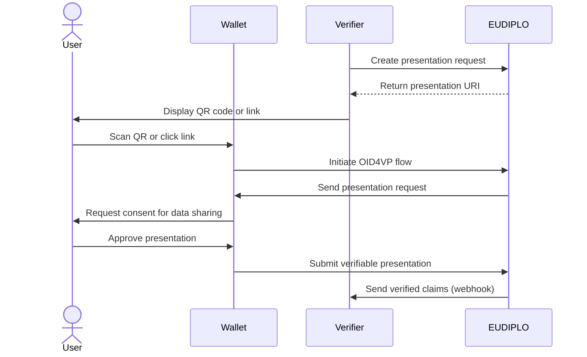
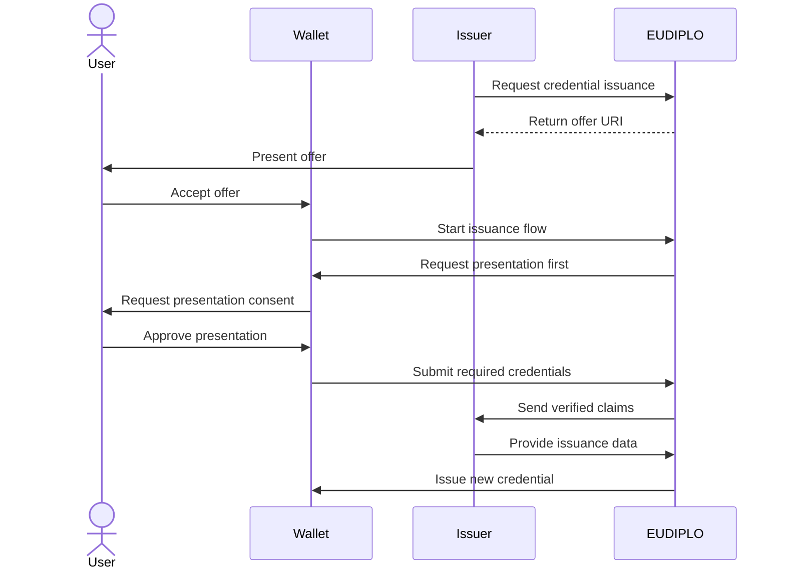

# Credential Presentation

EUDIPLO provides comprehensive credential presentation capabilities using
OpenID4VP (OpenID for Verifiable Presentations). This system allows verifiers to
request specific credentials and claims from users, enabling secure identity
verification and attribute validation.

---

## Overview

Credential presentation enables verifiers to:

- **Request specific credentials** from users' wallets
- **Verify authenticity** of presented credentials
- **Extract required claims** for authorization or validation
- **Maintain privacy** by requesting only necessary information
- **Support multiple presentation flows** for different use cases

EUDIPLO supports both standalone presentation flows and
presentation-during-issuance scenarios, providing flexibility for various
business requirements.

---

## Key Concepts

### Presentation Flows

EUDIPLO supports multiple presentation scenarios:

- Standard Presentation Flow
    - Direct credential verification requests
    - Used for access control and identity verification
    - Returns verified claims to the requesting service

- Presentation During Issuance
    - Credentials presented as prerequisites for new credential issuance
    - Enables qualification-based credential issuance
    - Supports complex identity verification workflows

### DCQL (Digital Credentials Query Language)

EUDIPLO uses
[DCQL](https://openid.net/specs/openid-4-verifiable-presentations-1_0.html#name-digital-credentials-query-l)
to define presentation requests:

- **Structured queries** for specific credentials and claims
- **Format specification** (e.g., `dc+sd-jwt`)
- **Selective disclosure** of only required attributes
- **VCT (Verifiable Credential Type) targeting** for precise credential matching

### Registration Certificates

All presentation requests include registration certificates that provide:

- **Legal basis** for data processing
- **Privacy policy** information
- **Contact details** for data protection inquiries
- **Purpose statements** explaining why data is requested

---

## Architecture

### Tenant-Based Configuration

EUDIPLO uses a tenant-based architecture where:

- Each tenant has isolated presentation configurations
- Configurations are stored securely in the database
- API access is scoped to the authenticated tenant
- Multi-tenant deployments maintain strict data isolation

### Session Management

Presentation flows create sessions that:

- Track the presentation request lifecycle
- Store temporary data during the exchange
- Enable asynchronous processing via webhooks
- Maintain audit trails for compliance

---

## Quick Start

For a quick start, follow these steps:

1. **Create a presentation configuration** - Define the presentation requirements using DCQL.
2. **Presentation request** - Initiate a presentation request using the created configuration.

### 1. Create a Presentation Configuration

See [Presentation Configuration](presentation-configuration.md) for detailed instructions on creating and managing presentation configurations.

### 2. Store the Configuration

Use the presentation management API to store the configuration. For detailed endpoint specifications, see:

**API Reference**: [Create Presentation Configuration](../../api/openapi.md#tag/presentation-management/POST/presentation-management)

### 3. Request a Presentation

Initiate a presentation request using the stored configuration. For detailed endpoint specifications, see:

**API Reference**: [Request Presentation](../../api/openapi.md#tag/presentation-management/POST/presentation-management/request)

!!! Info

    In this request you need to specify if the flow should use the DC API or not.

### 4. Present to User

The response includes a URI that can be presented to the user:

```json
{
    "uri": "openid4vp://?request_uri=https://your-domain.com/oid4vp/request/abc123&session_id=session-456",
    "session_id": "session-456"
}
```

---

## Flow Diagrams

### Standard Presentation Flow



### Presentation During Issuance

!!! Info

    Presentation during issuance is temporarily removed to be aligned with the latest OID4VCI spec. It will be reintroduced in a future release.



---

## Security Considerations

### Data Minimization

- **Request only necessary claims** to protect user privacy
- **Use selective disclosure** to limit exposed information
- **Implement purpose limitation** through clear registration certificates

### Authentication

- **OAuth 2.0 bearer tokens** for API authentication
- **Tenant isolation** prevents cross-tenant data access
- **Session-based security** with automatic cleanup

### Verification

- **Cryptographic validation** of presented credentials
- **Issuer verification** against trusted registries
- **Revocation status checking** for active credentials
