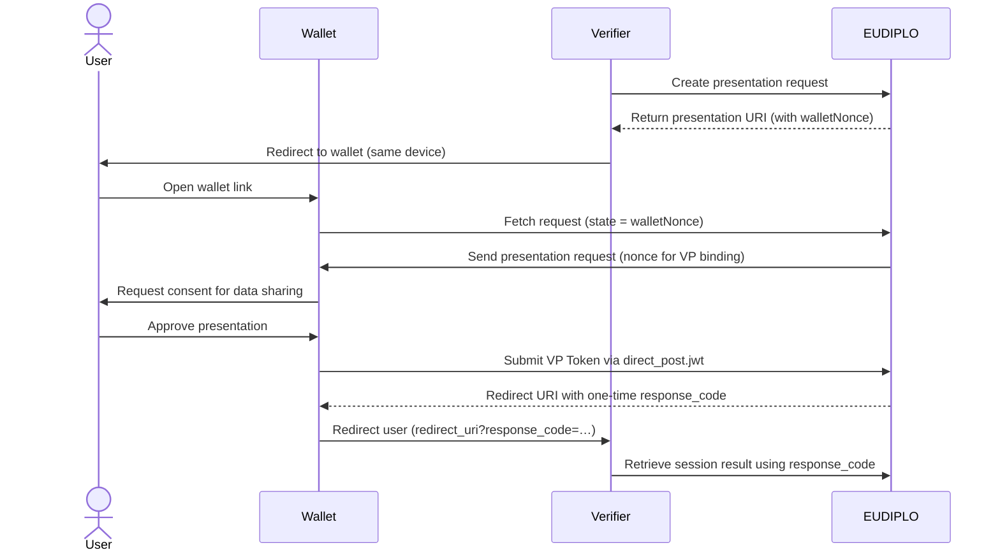
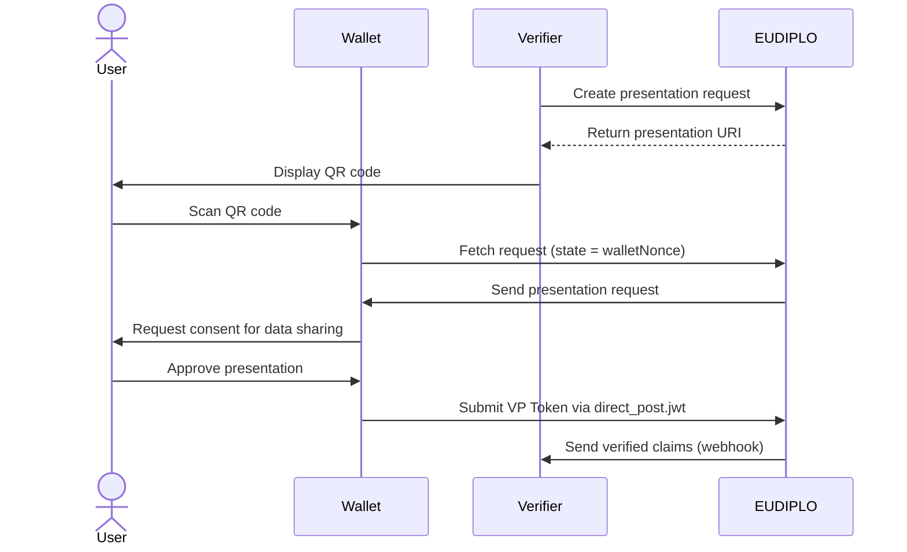
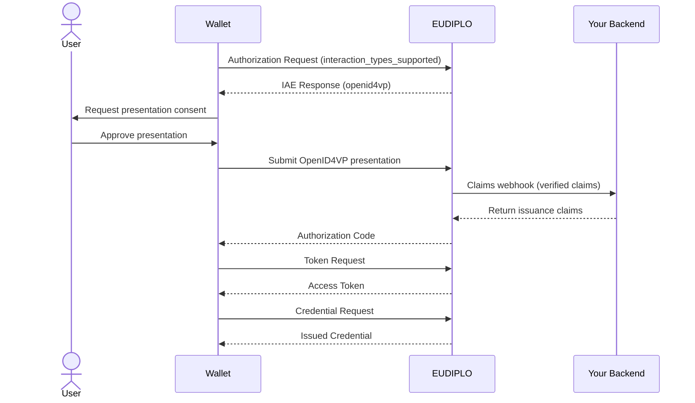

# Credential Presentation

EUDIPLO provides comprehensive credential presentation capabilities using
OpenID4VP (OpenID for Verifiable Presentations). This system allows verifiers to
request specific credentials and claims from users, enabling secure identity
verification and attribute validation.

---

## Overview

Credential presentation enables verifiers to:

- **Request specific credentials** from users' wallets
- **Verify authenticity** of presented credentials
- **Extract required claims** for authorization or validation
- **Maintain privacy** by requesting only necessary information
- **Support multiple presentation flows** for different use cases

EUDIPLO supports both standalone presentation flows and
presentation as part of credential issuance via the [Interactive Authorization Endpoint (IAE)](../../architecture/iae.md),
providing flexibility for various business requirements.

---

## Key Concepts

### Presentation Flows

EUDIPLO supports multiple presentation scenarios:

- Standard Presentation Flow
    - Direct credential verification requests
    - Used for access control and identity verification
    - Returns verified claims to the requesting service

- Presentation via Interactive Authorization (IAE)
    - Credentials presented as part of the issuance authorization flow
    - Enables qualification-based credential issuance
    - Supports multi-step workflows combining presentations with web-based verification
    - See [Interactive Authorization Endpoint](../../architecture/iae.md) for details

### DCQL (Digital Credentials Query Language)

EUDIPLO uses
[DCQL](https://openid.net/specs/openid-4-verifiable-presentations-1_0.html#name-digital-credentials-query-l)
to define presentation requests:

- **Structured queries** for specific credentials and claims
- **Format specification** (e.g., `dc+sd-jwt`)
- **Selective disclosure** of only required attributes
- **VCT (Verifiable Credential Type) targeting** for precise credential matching

### Registration Certificates

All presentation requests include registration certificates that provide:

- **Legal basis** for data processing
- **Privacy policy** information
- **Contact details** for data protection inquiries
- **Purpose statements** explaining why data is requested

---

## Architecture

### Tenant-Based Configuration

EUDIPLO uses a tenant-based architecture where:

- Each tenant has isolated presentation configurations
- Configurations are stored securely in the database
- API access is scoped to the authenticated tenant
- Multi-tenant deployments maintain strict data isolation

### Session Management

Presentation flows create sessions that:

- Track the presentation request lifecycle
- Store temporary data during the exchange
- Enable asynchronous processing via webhooks
- Maintain audit trails for compliance

---

## Quick Start

To manage presentation configurations, have a look at the [API Documentation](../../api/openapi.md#verifier) about the verifier. There you will find the endpoints to manage presentation configs and also to create presentation requests.

---

## Flow Diagrams

### Standard Presentation Flow (Same-Device)

In a same-device flow, the user's browser and wallet are on the same device.
EUDIPLO implements the security model from
[OID4VP §13.3](https://openid.net/specs/openid-4-verifiable-presentations-1_0.html#section-13.3)
to protect against session fixation and identifier correlation.

```mermaid
sequenceDiagram
    actor User
    participant Wallet
    participant Verifier
    participant EUDIPLO

    Verifier->>EUDIPLO: Create presentation request
    EUDIPLO-->>Verifier: Return presentation URI (with walletNonce)
    Verifier->>User: Redirect to wallet (same device)
    User->>Wallet: Open wallet link
    Wallet->>EUDIPLO: Fetch request (state = walletNonce)
    EUDIPLO->>Wallet: Send presentation request (nonce for VP binding)
    Wallet->>User: Request consent for data sharing
    User->>Wallet: Approve presentation
    Wallet->>EUDIPLO: Submit VP Token via direct_post.jwt
    EUDIPLO-->>Wallet: Redirect URI with one-time response_code
    Wallet->>Verifier: Redirect user (redirect_uri?response_code=…)
    Verifier->>EUDIPLO: Retrieve session result using response_code
```

### Standard Presentation Flow (Cross-Device)

In a cross-device flow, the user scans a QR code — the browser and wallet are
on different devices. No redirect occurs; the verifier polls for session
completion.

```mermaid
sequenceDiagram
    actor User
    participant Wallet
    participant Verifier
    participant EUDIPLO

    Verifier->>EUDIPLO: Create presentation request
    EUDIPLO-->>Verifier: Return presentation URI
    Verifier->>User: Display QR code
    User->>Wallet: Scan QR code
    Wallet->>EUDIPLO: Fetch request (state = walletNonce)
    EUDIPLO->>Wallet: Send presentation request
    Wallet->>User: Request consent for data sharing
    User->>Wallet: Approve presentation
    Wallet->>EUDIPLO: Submit VP Token via direct_post.jwt
    EUDIPLO->>Verifier: Send verified claims (webhook)
```

### Presentation via Interactive Authorization (IAE)

The Interactive Authorization Endpoint enables presentation requests as part of credential issuance.
This flow uses OID4VCI 1.1's authorization code flow with interactive authorization.

```mermaid
sequenceDiagram
    actor User
    participant Wallet
    participant EUDIPLO
    participant Backend as Your Backend

    Wallet->>EUDIPLO: Authorization Request (interaction_types_supported)
    EUDIPLO-->>Wallet: IAE Response (openid4vp)
    Wallet->>User: Request presentation consent
    User->>Wallet: Approve presentation
    Wallet->>EUDIPLO: Submit OpenID4VP presentation
    EUDIPLO->>Backend: Claims webhook (verified claims)
    Backend-->>EUDIPLO: Return issuance claims
    EUDIPLO-->>Wallet: Authorization Code
    Wallet->>EUDIPLO: Token Request
    EUDIPLO-->>Wallet: Access Token
    Wallet->>EUDIPLO: Credential Request
    EUDIPLO-->>Wallet: Issued Credential
```

For multi-step flows and configuration details, see [Interactive Authorization Endpoint](../../architecture/iae.md).

---

## Security Considerations

### Direct Post Security Model (OID4VP §13.3)

EUDIPLO implements the `direct_post.jwt` response mode with the full security
model defined in
[OID4VP Section 13.3](https://openid.net/specs/openid-4-verifiable-presentations-1_0.html#section-13.3).
This model separates identifiers across different actors to prevent session
fixation and cross-reference attacks.

**Key security properties:**

| Identifier      | Purpose                                                                                                  |
| --------------- | -------------------------------------------------------------------------------------------------------- |
| `session.id`    | Internal (backend / verifier) session identifier — never exposed to the wallet                           |
| `walletNonce`   | Wallet-facing identifier used as `state` in the authorization request — cannot be linked to `session.id` |
| `nonce`         | Binds the VP Token to this specific request — prevents replay attacks                                    |
| `response_code` | One-time code appended to `redirect_uri` during same-device redirect — prevents session fixation         |

**Same-device redirect flow:**

When a `redirect_uri` is configured, EUDIPLO generates a one-time
`response_code` and appends it to the redirect URI after the wallet submits its
response. The verifier's frontend receives this code via the redirect and uses
it to retrieve the session result. This ensures the browser that initiated the
flow is the same one that receives the result — an attacker who observes the
`walletNonce` in the QR code cannot hijack the redirect.

!!! warning "Same-device flows with redirect"
For same-device flows that use a `redirect_uri`, the `response_code` is
the **only safe way** to retrieve the session result. The verifier must
extract it from the redirect URL and use it to look up the completed
session.

### Data Minimization

- **Request only necessary claims** to protect user privacy
- **Use selective disclosure** to limit exposed information
- **Implement purpose limitation** through clear registration certificates

### Authentication

- **OAuth 2.0 bearer tokens** for API authentication
- **Tenant isolation** prevents cross-tenant data access
- **Session-based security** with automatic cleanup

### Trust Verification

- **Cryptographic validation** of presented credentials
- **Issuer verification** against trusted entities in trust lists
- **Revocation status checking** using the correct revocation certificate from
  the same trusted entity

For detailed information on how trust verification works, see
[Trust Framework](../../architecture/trust-framework.md).
