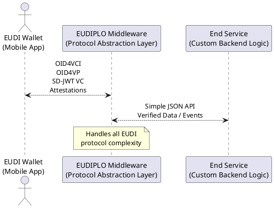

# EUDIPLO

**EUDIPLO** is a middleware that simplifies integration with the **EUDI Wallet** ecosystem. It provides a modular and standards-compliant backend for issuing, verifying, and managing verifiable credentials without needing to implement complex protocols directly.

Use EUDIPLO as a self-contained Docker container in your infrastructure to handle all EUDI-related operations securely and efficiently.

---

## ✨ Key Features

- Acts as a proxy between your backend systems and EUDI Wallets
- Exposes a full OpenAPI interface for issuing and verifying credentials
- Supports both file-based and Vault-based key management
- Stores session and configuration data using SQLite or PostgreSQL
- Easy to deploy via Docker with `.env`-based configuration

---

## 🧪 Supported Protocols

EUDIPLO supports a range of current and emerging standards in the EUDI Wallet ecosystem:

- [OpenID for Verifiable Presentation](https://openid.net/specs/openid-4-verifiable-presentations-1_0.html)
- [OpenID for Credential Issuance](https://openid.net/specs/openid-4-verifiable-credential-issuance-1_0.html)
- [SD-JWT VC](https://www.ietf.org/archive/id/draft-ietf-oauth-selective-disclosure-jwt-08.html)
- [Token Status List](https://drafts.oauth.net/draft-ietf-oauth-status-list/draft-ietf-oauth-status-list.html)

---

## 🚀 Get Started

To install and run EUDIPLO locally, check out the [Installation Guide](getting-started/installation.md). You can explore the [API Reference](api-reference.md) or learn about how EUDIPLO works in the [Architecture Overview](architecture/overview.md).

EUDIPLO helps you integrate modern identity standards with minimal effort.

---

## 🤝 Contributing

Want to contribute? Read the [contribution guidelines](https://github.com/cre8/EUDIPLO/blob/main/CONTRIBUTING.md).
