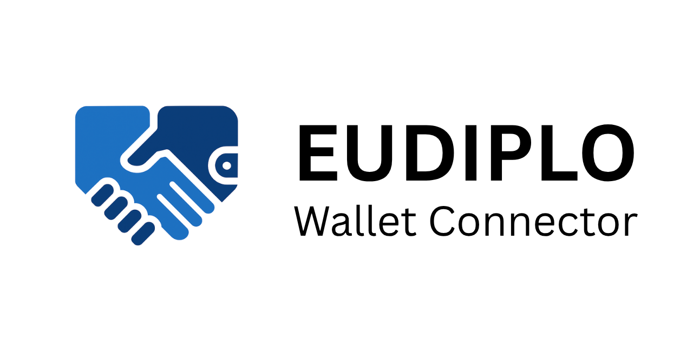
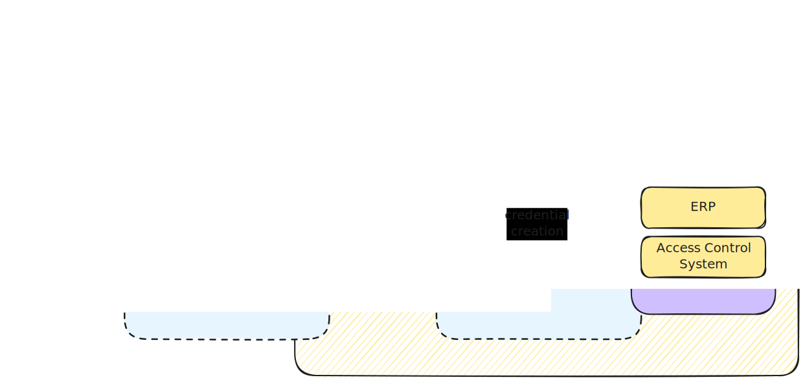

# What is EUDIPLO?

**EUDIPLO** is a lightweight, open-source **middleware layer** that bridges your
IT systems with the **European Digital Identity Wallet (EUDI Wallet)**
ecosystem.

Whether you're building services for government, education, healthcare, or the
private sector—EUDIPLO lets you interact with EUDI Wallets using simple
JSON-based APIs, without having to implement complex identity protocols
yourself.

!!! info "EUDIPLO stands for EUDI Protocol Liaison Operator"

    The name EUDIPLO is inspired by diplomat — because this middleware acts as
    a translator and trusted go-between. It speaks fluent EUDI specs on one side
    and down-to-earth JSON on the other, making sure your backend doesn't have to
    become a protocol expert overnight.

---

## Why EUDIPLO?

Connecting to the EUDI Wallet ecosystem is technically demanding:

- You must understand **OID4VCI**, **OID4VP**, **SD-JWT VC**, **mDOC (ISO 18013-5)**, and **OAuth-based
  status protocols**.
- Libraries are scattered, often **incomplete or language-specific**.
- Hosted services can lead to **vendor lock-in** or obscure how your data is
  processed.

**EUDIPLO solves these problems** by acting as a protocol abstraction layer you
can run yourself, integrate over HTTP, and configure via JSON.

---

## Key Capabilities

| Capability                  | Description                                                                                   |
| --------------------------- | --------------------------------------------------------------------------------------------- |
| 🛂 **Issuance**             | Issue credentials to users through the EUDI Wallet                                            |
| 🧾 **Presentation**         | Request credentials from users and verify them                                                |
| 🔄 **Cross-Flow Support**   | Request credentials as part of an issuance flow                                               |
| 🔐 **Secure by Default**    | Built-in support for secure key handling and OAuth-based status checking                      |
| 🧱 **Plug and Play**        | Integrates with your backend over HTTP; no requirement to use a specific programming language |
| 🖥️ **Web Client Included**  | Comes with a ready-to-use web interface for easy testing and interaction                      |
| ⚙️ **JSON Configurable**    | Set up templates, trust roots, and issuers through JSON files                                 |
| 🇪🇺 **Wallet Compatible**    | Works with multiple [wallets](./getting-started/wallet-compatibility.md)                      |
| ✅ **OIDF Conformant**      | Tested against the OpenID Foundation conformance suite for OID4VCI and OID4VP                 |
| 👥 **Multi-Tenant Support** | Isolate configurations for different tenants or clients                                       |

---

## Where Does It Fit?

Here’s how EUDIPLO fits into your infrastructure:



---

## 📺 Watch the Webinar

Learn more about EUDIPLO in our recorded webinar (September 17, 2025), featuring a deep dive into features, architecture, and live Q&A:

[](https://www.youtube.com/watch?v=GQlvHK-EFlU)

[Watch on YouTube](https://www.youtube.com/watch?v=GQlvHK-EFlU)

---

## 🤝 Community Call

Join our bi-weekly community call every Thursday:

[Participate via Zoom](https://zoom-lfx.platform.linuxfoundation.org/meeting/94494306854?password=0d272140-5b2b-4bd4-a8fe-0b70efe1aa86)

---

## How Do I Use It?

EUDIPLO is distributed as a Docker container and can be configured in minutes.

```shell
docker run -p 3000:3000 \
  -e PUBLIC_URL=https://example.com \
  ghcr.io/openwallet-foundation/eudiplo:latest
```

- `-p 3000:3000` exposes EUDIPLO locally on port 3000.
- `PUBLIC_URL` should be the public-facing URL where your instance is reachable (used for callbacks and wallet redirects).

➡️ For step-by-step instructions, see the [Quickstart Guide](./getting-started/quick-start.md).  
⚙️ For production deployment and advanced configuration, see [Production Setup](./architecture/index.md).

---

For more details on credential issuance and verification, check out:  
📘 [Configure credentials](./getting-started/issuance/index.md)  
📘 [Verify credentials](./getting-started/presentation/index.md)

---

## Who is it For?

EUDIPLO is built for:

- 🏛️ **Government services** that need to verify official documents.
- 🎓 **Universities and schools** that issue or validate diplomas.
- 🏥 **Health systems** managing patient identity or insurance.
- 🏢 **Private sector apps** that want to integrate trustable identity with
  minimal complexity.

If your organization needs to connect to the EUDI Wallet ecosystem—without
reinventing the wheel—**EUDIPLO is your gateway.**
