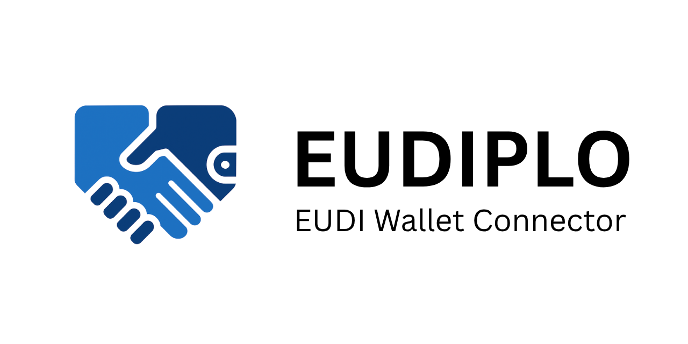

# What is EUDIPLO?

**EUDIPLO** is a lightweight, open-source **middleware layer** that bridges your
IT systems with the **European Digital Identity Wallet (EUDI Wallet)**
ecosystem.

Whether you're building services for government, education, healthcare, or the
private sector—EUDIPLO lets you interact with EUDI Wallets using simple
JSON-based APIs, without having to implement complex identity protocols
yourself.

---

## Why EUDIPLO?

Connecting to the EUDI Wallet ecosystem is technically demanding:

- You must understand **OID4VCI**, **OID4VP**, **SD-JWT VC**, and **OAuth-based
  status protocols**.
- Libraries are scattered, often **incomplete or language-specific**.
- Hosted services can lead to **vendor lock-in** or obscure how your data is
  processed.

**EUDIPLO solves these problems** by acting as a protocol abstraction layer you
can run yourself, integrate over HTTP, and configure via JSON.

---

## Key Capabilities

| Capability                  | Description                                                              |
| --------------------------- | ------------------------------------------------------------------------ |
| 🛂 **Issuance**             | Issue credentials to users through the EUDI Wallet                       |
| 🧾 **Presentation**         | Request credentials from users and verify them                           |
| 🔄 **Cross-Flow Support**   | Request credentials as part of an issuance flow                          |
| 🔐 **Secure by Default**    | Built-in support for secure key handling and OAuth-based status checking |
| 🧱 **Plug and Play**        | Integrates with your backend over HTTP; no SDK required                  |
| ⚙️ **JSON Configurable**    | Set up templates, trust roots, and issuers through JSON files            |
| 🇪🇺 **Wallet Compatible**    | Works with real-world EUDI Wallets like [Animo](https://animo.id)        |
| 👥 **Multi-Tenant Support** | Isolate configurations for different tenants or clients                  |

---

## Where Does It Fit?

Here’s how EUDIPLO fits into your infrastructure:


---

## How Do I Use It?

EUDIPLO is distributed as a Docker container and can be configured in minutes.

```bash
docker run -p 3000:3000 \
  -e PUBLIC_URL=https://example.com \
  -e JWT_SECRET=your-secret-key-here-minimum-32-characters \
  -e AUTH_CLIENT_ID=your-tenant-id \
  -e AUTH_CLIENT_SECRET=your-tenant-secret \
  -v $(pwd)/config:/app/config \
  ghcr.io/openwallet-foundation-labs/eudiplo:latest
```

➡️ Read the [Quickstart Guide](./getting-started/quick-start.md)  
📘 Learn how to [configure credentials](./getting-started/issuance.md) or
[verify them](./getting-started/presentation.md)

---

## Who is it For?

EUDIPLO is built for:

- 🏛️ **Government services** that need to verify official documents.
- 🎓 **Universities and schools** that issue or validate diplomas.
- 🏥 **Health systems** managing patient identity or insurance.
- 🏢 **Private sector apps** that want to integrate trustable identity with
  minimal complexity.

If your organization needs to connect to the EUDI Wallet ecosystem—without
reinventing the wheel—**EUDIPLO is your gateway.**
