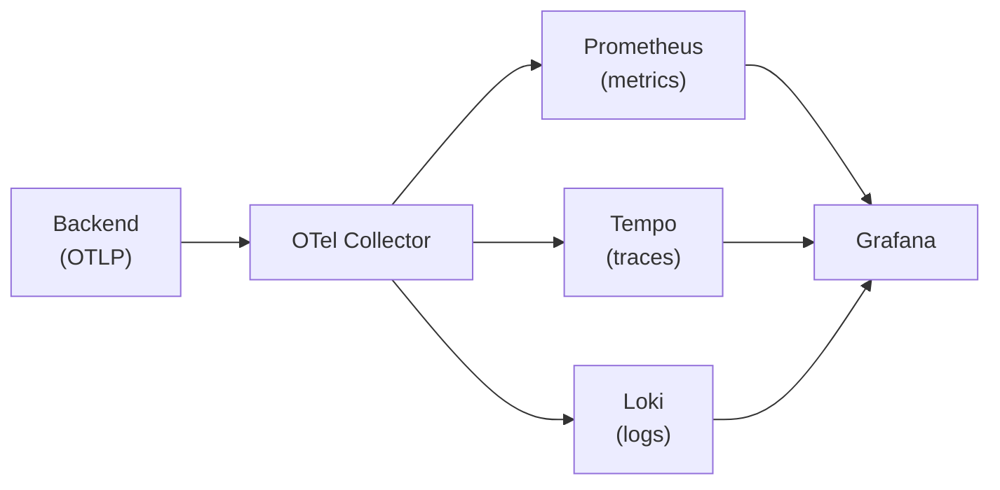

# EUDIPLO Monitoring Stack

This folder contains a complete observability setup for EUDIPLO using
OpenTelemetry, Prometheus, Tempo, Loki, and Grafana.

> **Note**: For comprehensive documentation, see the
> [Monitoring Guide](../docs/getting-started/monitor.md).

## Architecture



All telemetry signals (metrics, traces, logs) are exported from the backend via
OTLP to an **OpenTelemetry Collector**, which routes them to the appropriate
backends. Grafana provides unified visualization with cross-signal correlation
(e.g., jump from a trace to related logs, or from metrics to traces).

## Quick Start

From this `monitor` directory, run:

```bash
docker-compose up -d
```

This will start:

- **OpenTelemetry Collector** — receives OTLP on ports 4317 (gRPC) and 4318 (HTTP)
- **Prometheus** on http://localhost:9090 — metrics storage, scraped from the collector
- **Tempo** on http://localhost:3200 — distributed tracing backend
- **Loki** on http://localhost:3100 — log aggregation with OTLP ingestion
- **Grafana** on http://localhost:3001 — dashboards and exploration

## Backend Configuration

The backend exports telemetry via OTLP. Set these environment variables:

```bash
# OTLP endpoint (default: http://localhost:4318)
# Use http://otel-collector:4318 when running inside Docker Compose
OTEL_EXPORTER_OTLP_ENDPOINT=http://localhost:4318

# Disable OTel SDK entirely (useful for local dev without a collector)
OTEL_SDK_DISABLED=true
```

### Running Locally

```bash
# Terminal 1: Start the monitoring stack
cd monitor
docker-compose up -d

# Terminal 2: Start EUDIPLO backend (from project root)
pnpm --filter @eudiplo/backend dev
# The backend exports OTLP to localhost:4318 by default
```

### Running in Docker Compose

When running the full stack via Docker Compose, set the OTLP endpoint to the
collector's container name:

```bash
OTEL_EXPORTER_OTLP_ENDPOINT=http://otel-collector:4318
```

## Services

### OpenTelemetry Collector

- gRPC endpoint: `localhost:4317`
- HTTP endpoint: `localhost:4318`
- Prometheus metrics exporter: `localhost:8889/metrics`
- Config: `otel-collector/otel-collector-config.yml`

### Prometheus

- URL: http://localhost:9090
- Targets: http://localhost:9090/targets
- Scrapes the OTel Collector's Prometheus exporter on port 8889
- Config: `prometheus/prometheus.yml`
- Alert rules: `prometheus/rules/eudiplo.yml`

### Tempo

- URL: http://localhost:3200
- Receives traces from the collector via OTLP gRPC
- Config: `tempo/tempo.yml`

### Loki

- URL: http://localhost:3100
- Receives logs from the collector via OTLP HTTP
- Supports structured metadata from OpenTelemetry attributes
- Config: `loki/loki.yml`

### Grafana

- URL: http://localhost:3001
- Username: `admin` / Password: `admin`
- Pre-configured datasources: Prometheus, Tempo, Loki
- Cross-signal correlation enabled:
  - **Traces → Logs**: Jump from a span to its correlated log lines in Loki
  - **Traces → Metrics**: Link from traces to related Prometheus metrics
  - **Logs → Traces**: Extract `trace_id` from Pino log fields and link to Tempo

## Available Metrics

### Auto-Instrumented (via OpenTelemetry)

- `http_server_request_duration_seconds` — HTTP request duration histogram
- `http_server_active_requests` — Currently active HTTP requests
- Host metrics (CPU, memory, event loop) via `nestjs-otel`

### Business Metrics

- `sessions` — Active sessions by status and tenant
- `tenant_total` — Total number of tenants

## Alerting Rules

Pre-configured alerts in `prometheus/rules/eudiplo.yml`:

- **HighErrorRate** — HTTP 5xx rate exceeds 5% of total requests
- **ServiceDown** — OTel Collector target is down
- **HighResponseTime** — P95 response time exceeds 2 seconds

## Configuration

### OTel Collector

Edit `otel-collector/otel-collector-config.yml` to:

- Add new exporters (e.g., Jaeger, Zipkin, OTLP to a cloud vendor)
- Modify batching or sampling processors
- Add new pipelines

### Add Custom Alerts

1. Edit `prometheus/rules/eudiplo.yml`
2. Restart Prometheus: `docker-compose restart prometheus`

### Add Custom Dashboards

1. Create JSON files in `grafana/dashboards/`
2. Restart Grafana: `docker-compose restart grafana`

## Management Commands

```bash
# Start monitoring stack
docker-compose up -d

# View logs
docker-compose logs -f

# Stop monitoring stack
docker-compose down

# Stop and remove volumes (data loss!)
docker-compose down -v

# Restart specific service
docker-compose restart otel-collector
docker-compose restart prometheus
docker-compose restart grafana
```

## Data Persistence

- **Prometheus data**: `prometheus_data` Docker volume
- **Tempo data**: `tempo_data` Docker volume
- **Loki data**: `loki_data` Docker volume
- **Grafana data**: `grafana_data` Docker volume

## Troubleshooting

### Check Service Health

```bash
# All services
docker-compose ps

# OTel Collector metrics (should show received/exported telemetry)
curl http://localhost:8889/metrics

# Prometheus targets
curl http://localhost:9090/api/v1/targets

# Grafana health
curl http://localhost:3001/api/health
```

### Common Issues

1. **No traces/metrics appearing**
   - Verify the backend has `OTEL_EXPORTER_OTLP_ENDPOINT` set correctly
   - Check OTel Collector logs: `docker-compose logs otel-collector`
   - Ensure `OTEL_SDK_DISABLED` is not set to `true`

2. **No logs in Loki**
   - Loki 3.x uses native OTLP ingestion — check collector config exports to `/otlp`
   - Check Loki logs: `docker-compose logs loki`

3. **No data in Grafana**
   - Check Prometheus targets are UP at http://localhost:9090/targets
   - Verify datasource provisioning in `grafana/provisioning/datasources/`

4. **Trace-to-log correlation not working**
   - Ensure the backend uses `nestjs-pino` — trace context is auto-injected
   - Check the Loki datasource has `derivedFields` configured for `trace_id`

## Production Considerations

- Change default Grafana password
- Add authentication to Prometheus
- Configure proper data retention policies
- Use production-grade storage backends for Tempo and Loki (e.g., S3, GCS)
- Set up external storage for long-term data
- Add SSL/TLS termination
- Configure backup strategies
- Consider sampling strategies for high-throughput traces
